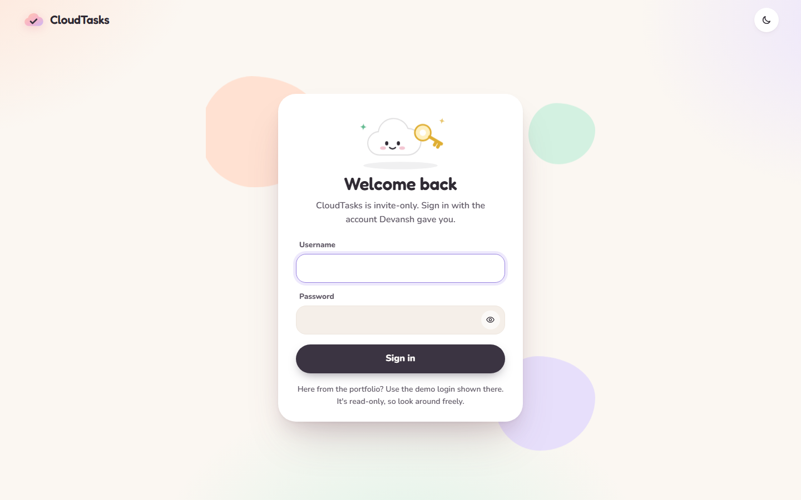
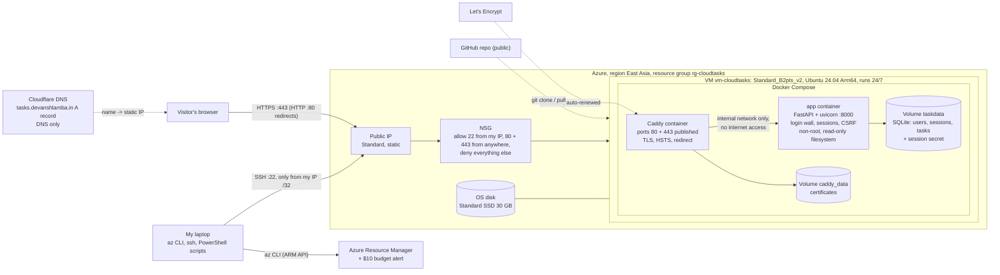

# CloudTasks on an Azure Linux VM

A soft, pastel task board with a live **VM status** panel, running 24/7 on an Ubuntu VM on Microsoft Azure behind Caddy with automatic HTTPS. Accounts are invite-only, and a read-only demo account is available.

**Live:** https://tasks.devanshlamba.in · College cloud-computing PBL, project #16: *Deployment to a publicly hosted Linux VM on Azure*.

| Signed in as the demo account (desktop) | Sign-in page |
|---|---|
|  |  |

| VM status, dark theme | Mobile |
|---|---|
|  |  |

## What it is

- **Tasks**: create, edit, complete and delete tasks, each with a title (max 120 characters), an optional note, a priority (low / medium / high), an optional due date and a pastel card colour. Cards sit in a masonry grid, with search, filters (All / Active / Done), sorting, undo on delete and keyboard shortcuts (`N` new task, `/` search, `Esc` close).
- **VM status**: live CPU, memory, disk, load average, uptime, health and response time, refreshed every 2.5 seconds, plus the Azure region, VM size, VM name and public IP.
- **Accounts**: invite-only, with no public sign-up. Every user sees only their own tasks. The **demo** account (its login is on my portfolio) is read-only: it can look at its 10 sample tasks and the VM status, but every change is rejected.
- Light theme by default plus a dark pastel theme; works on phones; respects *reduced motion*.

## Architecture



**Request path:** browser → `tasks.devanshlamba.in` (Cloudflare DNS, *DNS only*) → static public IP → NSG (443 allowed) → Caddy (TLS) → app over a Docker network marked `internal` → SQLite on a named volume. The app has no published port and no route to the internet. Without a valid session, every page redirects to `/login` and every `/api` call returns 401.

## Tech stack

| Layer | Choice |
|---|---|
| Backend | Python 3.13, FastAPI, uvicorn, SQLite (stdlib `sqlite3`), psutil, argon2-cffi |
| Frontend | One HTML page and a sign-in page, plain CSS and JavaScript, self-hosted Fredoka and Nunito fonts, inline SVG charts; no CDN, no framework |
| Containers | `python:3.13-slim` (non-root, healthcheck), `caddy:2.11-alpine` (automatic HTTPS) |
| Cloud | Azure VM (IaaS), static public IP, network security group, managed disk, cloud-init, Cost Management budget |
| DNS / TLS | Cloudflare DNS (A record, *DNS only*), Let's Encrypt certificate obtained and renewed by Caddy |
| Automation | Azure CLI in PowerShell scripts, Playwright for screenshots, pytest |

## API

| Method and path | Purpose | Who |
|---|---|---|
| `POST /api/auth/login` | Sign in: `{username, password}` sets the session cookie and returns `{username, role, csrf_token}` | anyone (throttled) |
| `POST /api/auth/logout` | Sign out and delete the session on the server | signed in |
| `GET /api/auth/me` | Current user and CSRF token | signed in |
| `GET /api/tasks` | Your tasks | signed in |
| `POST /api/tasks`, `PATCH /api/tasks/{id}`, `POST /api/tasks/{id}/toggle`, `DELETE /api/tasks/{id}`, `POST /api/tasks/sample` | Change your tasks (send `X-CSRF-Token`) | signed in, not demo |
| `GET /api/metrics`, `GET /api/info` | VM status | signed in |
| `GET /health` | `{"status": "ok"}` | public |

Limits: `/api` allows 300 requests per minute per visitor IP, and the demo account 60. Sign-in allows 10 failed attempts per IP and 5 per username in 15 minutes, with a 1-second delay on every failure. The demo account has no per-username lockout, because its password is public and anyone could otherwise lock it.

## Accounts

Accounts are created on the VM with a small CLI. **Passwords are typed at a hidden prompt** (never a command-line argument, so never in shell history), at least 12 characters, and stored only as argon2id hashes.

```bash
ssh -i ~/.ssh/cloudtasks_azure_ed25519 azureuser@<vm-ip>
cd /opt/cloudtasks
sudo docker compose exec -it app python -m app.manage_users create alice                 # role: user
sudo docker compose exec -it app python -m app.manage_users create devansh --role admin
sudo docker compose exec -it app python -m app.manage_users create demo --role demo     # + 10 sample tasks
sudo docker compose exec -it app python -m app.manage_users list                         # no hashes shown
sudo docker compose exec -it app python -m app.manage_users reset alice                  # new password, signs out everywhere
sudo docker compose exec -it app python -m app.manage_users delete alice                 # with their tasks
```

## Run it locally

Requirements: Docker Desktop (or Docker Engine with the Compose plugin).

```bash
docker compose up -d --build          # http://localhost/ (plain HTTP locally; no certificate needed)
docker compose exec -it app python -m app.manage_users create me
docker compose down                   # stop (the database volume is kept)
```

Tests, inside the same image the app uses, or with Python directly:

```bash
docker build --target test .
python -m venv .venv && .venv/Scripts/pip install -r requirements-dev.txt && .venv/Scripts/python -m pytest -q
```

## Deploy to Azure

Requirements: Azure CLI logged in (`az login`), PowerShell 5.1 or 7, an OpenSSH client, and a DNS name you control.

```powershell
./scripts/deploy.ps1 -PlanOnly    # checks + planned resources + cost per day; creates nothing
./scripts/deploy.ps1              # same, then asks you to type "yes" and creates everything
```

1. **Checks:** you're logged in, the subscription's *Allowed resource deployment regions* policy allows the region, and the VM size is available to your subscription there. Subscription and tenant IDs are never printed.
2. **Plan:** shows the resources with live prices (Azure Retail Prices API) and waits for `yes`.
3. **Creates:** a resource group, a static public IP, an NSG (SSH only from your current IP /32, HTTP and HTTPS open), a VNet and the VM (Ubuntu 24.04, SSH key only).
4. **cloud-init** on the VM installs Docker from Docker's apt repository, adds 1 GiB of swap, clones this repo, writes the non-secret settings to `.env` (domain, region, VM size, VM name, public IP) and runs `docker compose up -d --build`.
5. **DNS:** add an **A record** for the name pointing to the new IP, *DNS only* (no proxy). Caddy then gets the Let's Encrypt certificate by itself.
6. **Verifies** from your laptop: a valid certificate, HTTP → HTTPS, `/login` loads, `/api` returns 401 without a session, `/health` is ok.
7. Create the accounts (above), then turn on HSTS: `./scripts/update.ps1 -EnableHsts`.

### Day-to-day scripts and what each state costs

| Script | What it does | Cost per day afterwards |
|---|---|---|
| `scripts/status.ps1` | Read-only report: VM power state, DNS, certificate issuer and expiry, redirect, 401 check, containers, cost | unchanged |
| `scripts/update.ps1` | Pulls the latest commit on the VM and rebuilds; makes sure 443 is open and no auto-shutdown exists; `-EnableHsts` | unchanged |
| `scripts/start.ps1` | Starts the VM, re-pins the SSH rule to your current IP, verifies HTTPS | **0.477 USD** (running 24/7) |
| `scripts/pause.ps1` | Deallocates the VM: compute billing stops; disk, IP, certificates and data are kept | **0.199 USD** (disk + static IP) |
| `scripts/destroy.ps1` | Deletes the whole resource group after you type its name | **0 USD** |
| `scripts/budget.ps1 -Email you@example.com` | Monthly budget (default 10 USD) with e-mail alerts at 50% / 100% actual and 100% forecast | free |

Prices are pay-as-you-go for East Asia (October 2026): VM 0.0116 USD/hour, static public IP 0.005 USD/hour (also charged while the VM is stopped), Standard SSD E4 disk 2.40 USD/month. Running 24/7 costs about **14.5 USD/month**, so 100 USD of Azure for Students credit lasts about **209 days (until about end of April 2027)**. Outbound data: the first 100 GB/month are free. No card is involved.

## Why East Asia and B2pts_v2

The Azure for Students policy on this subscription allows five regions. When the project started (with a nightly auto-shutdown, removed later for 24/7 hosting), only one region met all the requirements:

| Region | Auto-shutdown supported | Cheap B-series sizes available to this subscription |
|---|---|---|
| **East Asia** | yes | **yes**: B2pts_v2, B2ats_v2, B2als_v2 |
| UAE North | yes | no, all blocked (`NotAvailableForSubscription`) |
| India South Central | no | yes |
| Malaysia West, Indonesia Central | no | no |

**Standard_B2pts_v2** (2 vCPU Arm64, 1 GiB RAM) is the cheapest available size. The whole stack uses about 60 MiB (app 41 MiB, Caddy 15 MiB), and about 530 MB of memory stays free.

## Security

- **Network:** the NSG allows SSH only from the deployer's IP /32 and HTTP/HTTPS from anywhere; everything else is denied. The app container is on an `internal` Docker network: no published port, no internet access. Only Caddy is reachable.
- **HTTPS:** a Let's Encrypt certificate, renewed automatically by Caddy about 30 days before expiry. HTTP redirects to HTTPS (308). HSTS is `max-age=31536000` (no `includeSubDomains`, no preload). The `Server` header is removed.
- **Accounts:** argon2id password hashes (OWASP parameters), a 12-character minimum, passwords only at a hidden prompt. Sign-in errors are generic, and unknown usernames still run a hash check, so the response doesn't reveal which accounts exist.
- **Sessions:** a 256-bit random token in a `__Host-` cookie (HttpOnly, Secure, SameSite=Lax, 7 days). The database stores only an HMAC of the token, keyed with a secret generated on the VM (file mode 0600, never in git). Logout and password resets delete sessions on the server.
- **CSRF:** every state-changing request needs the per-session token in `X-CSRF-Token` (constant-time comparison) and, if the browser sends `Origin`, it must be this site.
- **Authorisation:** every task query is filtered by the signed-in user's ID; another user's task returns 404. The demo role gets 403 on every write.
- **Containers:** non-root app (uid 10001), read-only filesystems, all Linux capabilities dropped (Caddy keeps only `NET_BIND_SERVICE`), `no-new-privileges`, memory/CPU/process limits; the Docker socket is never mounted.
- **Input and output:** strict validation, SQL with bound parameters only, user text rendered with `textContent` only, and a strict Content-Security-Policy (no inline scripts), plus `X-Frame-Options`, `nosniff` and `no-referrer`.
- **Rate limiting:** the visitor IP from `X-Real-IP` / `X-Forwarded-For` is trusted only from Caddy's fixed address on the internal network, so spoofed headers can't bypass the limits.
- **No secrets** in the repo, the image, the logs or the screenshots.

### Threat model (short)

| Protected against | How |
|---|---|
| Eavesdropping and tampering on the network | HTTPS everywhere, HSTS |
| Strangers reading or changing tasks | Login wall on every page and `/api` route; per-user queries |
| One user reading another user's tasks | Every query filters by `user_id` (tested) |
| Password guessing | argon2id, per-IP and per-username limits, a delay on failures |
| Stolen database copy | Only password hashes and keyed session-token hashes are stored |
| CSRF and clickjacking | CSRF token + Origin check, SameSite cookies, `frame-ancestors 'none'` |
| XSS | `textContent` only, strict CSP |
| Vandalism through the public demo login | Demo role is read-only, with its own stricter rate limit |

| Not protected against (accepted for this project) | Why / mitigation |
|---|---|
| A compromised VM or Azure account | Out of scope; SSH is key-only and limited to one IP |
| Denial of service from many IPs | No CDN/WAF in front (Cloudflare proxy is off); the per-IP limits help only partly |
| Account takeover with a reused password | No MFA; invite-only and a 12-character minimum reduce the risk |
| Data loss | No backups yet: the SQLite file lives on the VM's disk |
| Rate-limit state after a restart | Counters are in memory, so a restart resets them |

## Project layout

```
app/                 FastAPI app (main, auth, db, schemas, system, rate limiter, user CLI, samples) + static UI
tests/               pytest: API, auth/security, hostname (41 tests)
caddy/Caddyfile      HTTPS reverse proxy configuration
Dockerfile           runtime image + "test" stage
docker-compose.yml   Caddy + app, internal network, volumes, limits
scripts/             deploy / start / pause / update / status / budget / destroy (PowerShell), cloud-init, screenshots, report build
docs/                report.md (PBL report, also as .docx and .pdf), architecture.png, screenshots/
```

## Licence notes

Fredoka and Nunito are used under the SIL Open Font License 1.1 (see `app/static/fonts/LICENSE.txt`).
