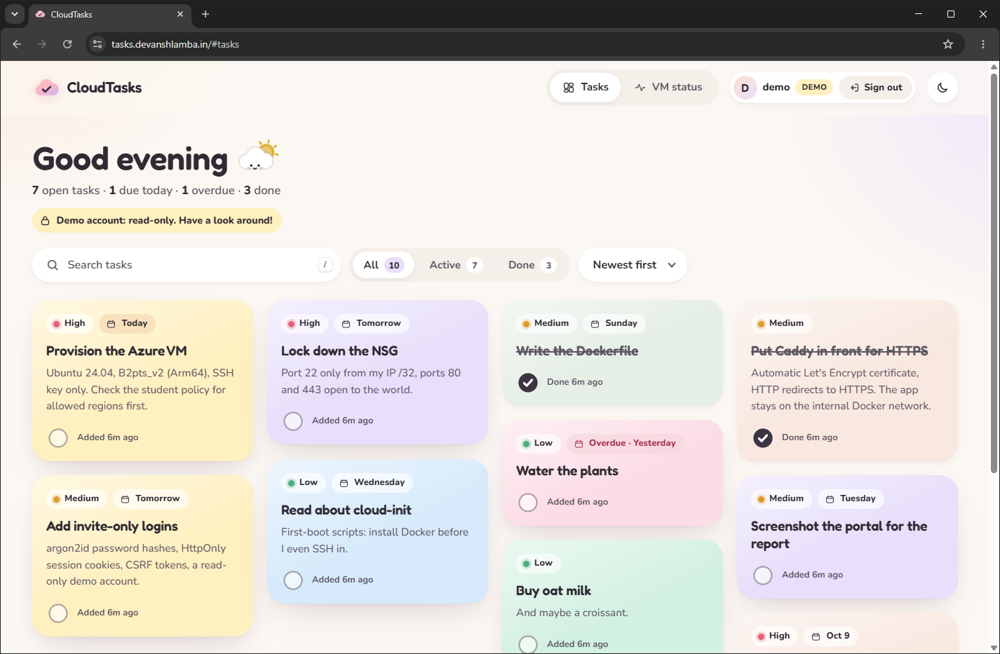
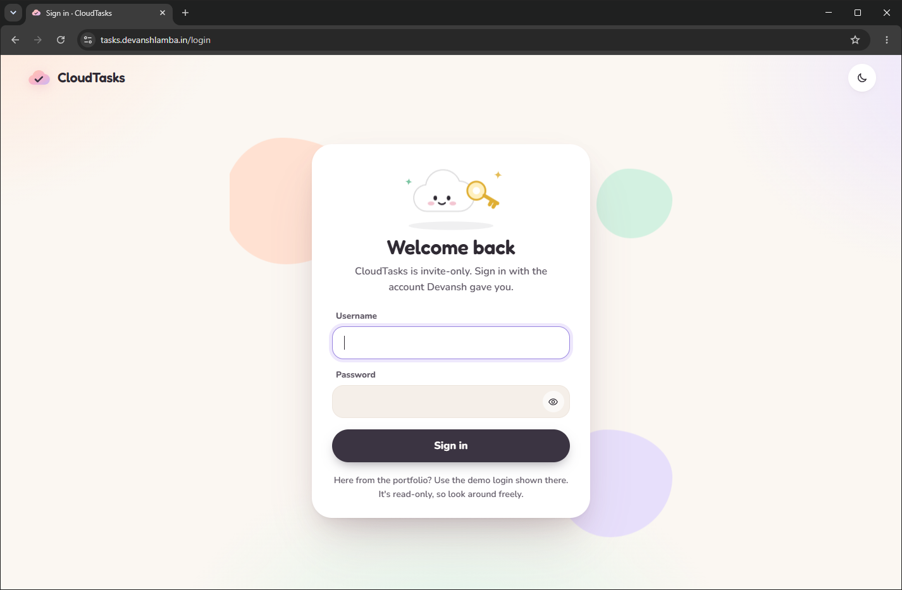
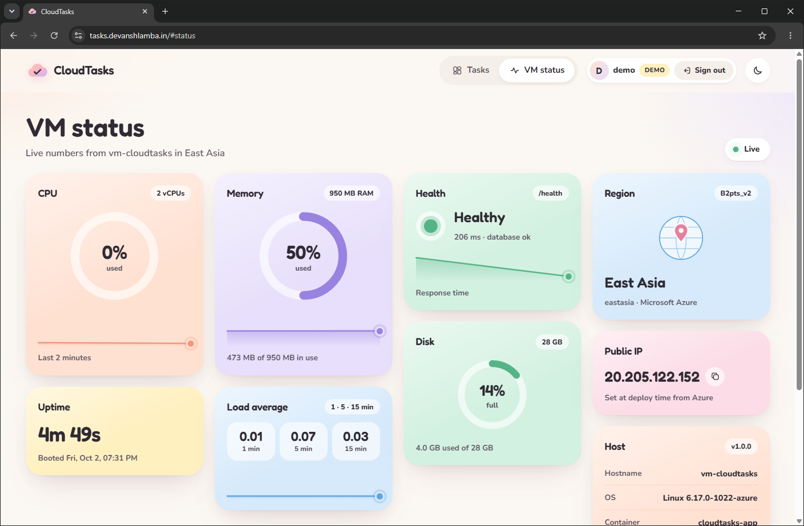
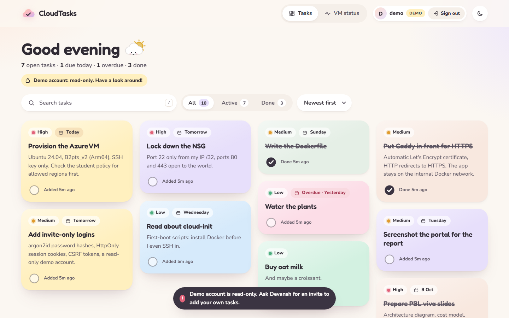
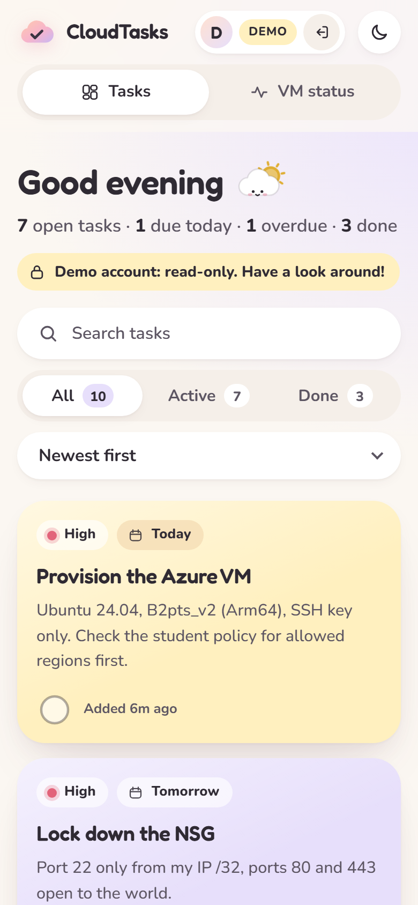
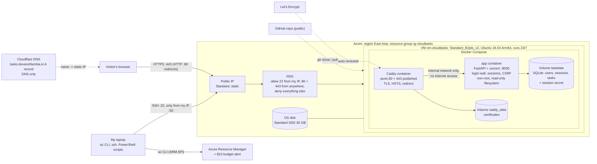

# CloudTasks: a task board deployed to a Linux VM on Azure

CloudTasks is a small web app for keeping a list of tasks, with a second page that shows live numbers from the server it runs on (CPU, memory, disk, uptime). I built it as a college cloud-computing project to learn how to put a real app on a real public server: a Linux virtual machine on Microsoft Azure, reachable over HTTPS at its own address, with logins, a firewall and automated setup scripts. Everything in this repository is the actual code and configuration that runs the live site.

**Live site:** https://tasks.devanshlamba.in. You need an account to sign in. Accounts are invite-only; a read-only demo account is available (its login is shared on my portfolio, not here).

| The task board (signed in as the demo account) | The sign-in page |
|---|---|
|  |  |

| Live VM status | Read-only demo message | On a phone |
|---|---|---|
|  |  |  |

---

## Contents

1. [What is this project?](#1-what-is-this-project)
2. [How it works in 60 seconds](#2-how-it-works-in-60-seconds)
3. [The tech stack](#3-the-tech-stack)
4. [Features](#4-features)
5. [Security, explained simply](#5-security-explained-simply)
6. [Deployment, step by step](#6-deployment-step-by-step)
7. [Run it on your own computer](#7-run-it-on-your-own-computer)
8. [Costs](#8-costs)
9. [Project structure](#9-project-structure)
10. [What I learned, and the limitations](#10-what-i-learned-and-the-limitations)
11. [FAQ](#11-faq)
12. [Credits and licence](#12-credits-and-licence)

---

## 1. What is this project?

**The problem.** Writing an app that runs on your own laptop is one skill. Putting it on the internet, so anyone can open it with a normal web address, is a different set of skills: renting a server, opening the right network ports and closing all others, getting an HTTPS certificate, keeping passwords safe, and knowing what it costs. This project is how I practised those skills from start to finish.

**What it is.** A *learning project*, not a product. It is project #16 of my Cloud Computing course: *"Deployment to a publicly hosted Linux VM on Azure"*. The app itself (a task board) is deliberately simple, so that most of the work could go into the deployment, the security and the documentation.

**Who it is for.**

- **Teachers and evaluators**, who want to see how a cloud deployment is done and documented. The full project report is in [`docs/report.md`](docs/report.md) (also as [Word](docs/report.docx) and [PDF](docs/report.pdf)).
- **Recruiters**, who want to see working code and a live site.
- **Classmates**, who want a worked example they can copy and learn from.
- **Me and a few friends**, who use the board to keep our own task lists.

**What it is not.** It is not built to handle thousands of users, and it has no backups or automatic failover. Section [10](#10-what-i-learned-and-the-limitations) lists the limitations honestly.

---

## 2. How it works in 60 seconds



### What happens when someone opens the website

1. **The name is turned into a number (DNS).** The browser asks the internet's "phone book" (DNS, the Domain Name System) for the address of `tasks.devanshlamba.in`. Cloudflare, which hosts my domain's DNS, answers with the server's IP address, `20.205.122.152`.
2. **The request reaches Azure.** The browser connects to that IP address. The address belongs to a *static public IP* in Azure, which is attached to my virtual machine.
3. **The firewall checks it.** A *network security group* (Azure's firewall) only lets through web traffic (ports 80 and 443) from anyone, and SSH (port 22) only from my own IP address. Everything else is dropped.
4. **Caddy answers first.** On the VM, a program called **Caddy** receives the request. Plain HTTP requests (port 80) are redirected to HTTPS. For HTTPS requests (port 443), Caddy handles the encryption using a free certificate from **Let's Encrypt**, then forwards the request to the app over a private internal network.
5. **The app decides what to show.** The app (written in Python with **FastAPI**) checks whether the browser sends a valid *session cookie* (a small ticket that says "this person signed in"). Without one, the visitor is sent to the sign-in page, and any data request gets the answer `401 Unauthorized`.
6. **The data comes from a file database.** For a signed-in user, the app reads that user's tasks, and only that user's, from a **SQLite** database file and sends them back as JSON (a simple text format for data).
7. **The page draws itself.** JavaScript in the browser turns the JSON into the pastel task cards. On the VM status page, the browser asks the app for fresh server numbers every 2.5 seconds and updates the gauges and small line charts.

Both programs (Caddy and the app) run inside **Docker containers**, which are explained in the next section.

---

## 3. The tech stack

Every technology below is actually used in this repository. Where a common tool was *not* used, the table says so.

### Cloud and infrastructure

| Technology | What it is (simple) | Why I used it | Where in this repo |
|---|---|---|---|
| **Microsoft Azure** (Azure for Students) | A cloud provider: a company that rents out computers, storage and networks by the hour. | The course is about Azure, and the student offer gives 100 USD of credit without a credit card. | All `scripts/*.ps1` |
| **Virtual machine (VM)**: `Standard_B2pts_v2`, Ubuntu 24.04 Arm64 | A computer that exists only in software inside Azure's data centre. You get a full Linux system you control, like renting a flat instead of a hotel room. This model is called **IaaS** (Infrastructure as a Service). | The project is specifically about deploying to a VM. This size (2 virtual CPUs, 1 GiB memory, an Arm processor) was the cheapest size my subscription was allowed to use in a permitted region. | `scripts/common.ps1` (settings), `scripts/deploy.ps1` |
| **Static public IP** (Standard SKU) | A fixed internet address for the VM. "Static" means it does not change when the VM restarts. | The DNS name has to point at an address that never changes. | `scripts/deploy.ps1` |
| **Network security group (NSG)** | Azure's firewall: a list of rules saying which network traffic may reach the VM. Like a guard with a guest list. | To allow only web traffic (80, 443) from everyone and SSH (22) only from my own IP. | `scripts/deploy.ps1`, `scripts/update.ps1`, `scripts/start.ps1` |
| **Managed disk** (Standard SSD, 30 GB) | The VM's hard drive, stored and billed by Azure separately from the VM. | Holds the operating system, Docker images and the database. | `scripts/deploy.ps1` |
| **Azure CLI** (`az`) | A command-line program to create and control Azure resources by typing commands instead of clicking in the website. | Commands can be saved in scripts and repeated exactly. | Every `scripts/*.ps1` |
| **PowerShell scripts** | Scripts for Windows' command shell that run many `az` and `ssh` commands in order, with checks in between. | The whole setup (deploy, start, pause, update, status, destroy) is one command each. I did **not** use OpenTofu or Terraform (tools that describe infrastructure as configuration files); plain scripts were simpler for one VM. | `scripts/` |
| **SSH keys** (ed25519) | SSH is a secure way to log in to a remote computer's command line. A *key pair* replaces the password: the server holds the public half, my laptop keeps the private half. | Password logins on public servers get attacked constantly; key-only login is much safer. | `scripts/deploy.ps1` creates the key (it stays on my laptop) |
| **cloud-init** | A standard way to give a new Linux VM a list of setup steps to run on its very first start. | The VM installs Docker, downloads this repo and starts the app by itself, with no manual typing. | `scripts/cloud-init.yaml` |
| **Azure Cost Management budget** | A spending limit that sends e-mails when costs reach a percentage of an amount. It warns; it does not stop anything. | A safety net so the student credit cannot run out unnoticed. | `scripts/budget.ps1` |
| **Azure Retail Prices API** | A free, public price list from Microsoft that programs can read. | The scripts show the real, current cost per day before creating anything. | `scripts/common.ps1` (`Get-CostModel`) |
| **Cloudflare DNS** | The service that hosts the DNS records of my domain `devanshlamba.in`. | I already used it for my domain. One "A record" points `tasks.devanshlamba.in` at the VM's IP. It is set to "DNS only", see the [FAQ](#why-dns-only-grey-cloud-in-cloudflare). | Configured in Cloudflare's dashboard (not in the repo) |
| **Git and GitHub** | Git tracks every change to the code; GitHub hosts the repository online. | The VM downloads the code from this public repository. | The whole repo |

### Containers and HTTPS

| Technology | What it is (simple) | Why I used it | Where in this repo |
|---|---|---|---|
| **Docker** | A tool that packages an app with everything it needs into an *image*, and runs it as an isolated *container*. Like a shipping container: it runs the same way on any computer. | The app runs identically on my laptop and on the VM, and it is isolated from the rest of the system. | `Dockerfile`, `.dockerignore` |
| **Docker Compose** | A tool that starts several containers together from one configuration file, with their networks and storage. | One command starts Caddy and the app, with a private network between them and the security limits applied. | `docker-compose.yml` |
| **Docker volumes** | Storage that belongs to Docker and survives when a container is rebuilt or restarted. | The database and the HTTPS certificates must survive updates and reboots. | `docker-compose.yml` (`taskdata`, `caddy_data`, `caddy_config`) |
| **Caddy** | A web server that also acts as a *reverse proxy*: it receives visitors' requests and passes them on to the app, like a receptionist forwarding calls. | It gets and renews HTTPS certificates fully automatically and its configuration is about 30 lines. See the [FAQ](#why-caddy-and-not-nginx). (Phase 1 of the project used nginx.) | `caddy/Caddyfile`, `docker-compose.yml` |
| **HTTPS / TLS** | Encryption for web traffic. The lock icon in the browser. Nobody between the visitor and the server can read or change the data. | Passwords and session cookies must never travel in plain text. | Handled by Caddy |
| **Let's Encrypt** | A free, non-profit authority that issues HTTPS certificates (the "ID card" that proves the site is really `tasks.devanshlamba.in`). | Free, trusted by all browsers, and Caddy talks to it automatically. Certificates last 90 days and Caddy renews them about 30 days before they expire. | Used by Caddy; certificates are stored in the `caddy_data` volume |
| **HSTS** | A header that tells browsers "only ever use HTTPS for this site". | Stops a browser from ever falling back to unencrypted HTTP. Turned on only after HTTPS was confirmed working. | `caddy/Caddyfile` (`HSTS_MAX_AGE`) |

### The app

| Technology | What it is (simple) | Why I used it | Where in this repo |
|---|---|---|---|
| **Python 3.13** | The programming language of the server side. | Readable and well suited to small web services. | `app/` |
| **FastAPI** + **uvicorn** | FastAPI is a Python framework for building web APIs (URLs that send and receive data). uvicorn is the program that runs it and listens for requests. | Small, fast, and it validates incoming data automatically. | `app/main.py` |
| **Pydantic** | A library (included with FastAPI) that checks that incoming data has the right shape, for example "title: text, at most 120 characters". | Bad input is rejected before it reaches the database. | `app/schemas.py` |
| **SQLite** | A complete database stored in one file, built into Python. No separate database server. | Enough for a few users, nothing extra to run or pay for. See the [FAQ](#why-sqlite). | `app/db.py` |
| **psutil** | A Python library that reads system numbers: CPU use, memory, disk, uptime, load. | Powers the live VM status page. | `app/system.py` |
| **argon2-cffi** (argon2id) | A library for *password hashing*: turning a password into a scrambled value that cannot be turned back. argon2id is designed to be slow and memory-hungry on purpose, so guessing is expensive. | Passwords are never stored, only their hashes. It is the algorithm OWASP (a security community) recommends. | `app/auth.py` |
| **Server-side sessions** | After signing in, the browser gets a random "ticket" in a cookie; the server keeps a matching record. Signing out deletes the record. | Simple, and a session can really be ended (unlike tickets that only expire). | `app/auth.py`, `app/db.py` |
| **CSRF tokens** | CSRF ("cross-site request forgery") is a trick where another website makes your browser send a request to this site while you are signed in. A CSRF token is a secret only the real page knows; every change must include it. | Blocks those forged requests. | `app/auth.py`, `app/static/app.js` |
| **Rate limiting** | Counting how many requests one visitor makes per minute and refusing extra ones. Like a "max 5 per customer" sign. | Slows down password guessing and abuse of the public demo account. | `app/ratelimit.py`, `app/auth.py` |
| **HTML, CSS and JavaScript** (no framework) | The three languages of web pages: structure, style and behaviour. | A small app does not need a framework like React. Fonts (Fredoka, Nunito) and icons are stored in the repo, so the site loads nothing from other websites. | `app/static/` |

### Testing and documentation tools

| Technology | What it is (simple) | Why I used it | Where in this repo |
|---|---|---|---|
| **pytest** (+ **httpx2**) | pytest runs automated tests; httpx2 lets the tests act like a browser talking to the app. | 41 tests check that logins, permissions, CSRF, rate limits and the task features work, on every change. | `tests/`, `pytest.ini`, `requirements-test.txt` |
| **Playwright** | A tool that controls a real Chromium browser from code. | Takes the screenshots in `docs/screenshots/` automatically and checks for browser errors. | `scripts/https_screenshots.py` and the other `*_screenshots.py` scripts |
| **Pillow**, **python-docx**, Microsoft Word | An image library, a library that writes Word files, and Word itself (for the table of contents and the PDF export). | To capture browser windows and to build `docs/report.docx` and `docs/report.pdf` from `docs/report.md`. | `scripts/window_screenshots.py`, `scripts/build_report.py` |

---

## 4. Features

### The task board

**What it does.** Each user has their own board of task cards in a "masonry" grid (cards of different heights packed together, like Pinterest). A task has:

- a title (1 to 120 characters) and an optional note (up to 500 characters),
- a priority (low, medium, high), shown as a coloured dot,
- an optional due date, shown as "Today", "Tomorrow", a weekday, or "Overdue" in red,
- a pastel card colour (peach, mint, lavender, butter, sky, blush),
- a round checkbox; done tasks get a gentle strike-through.

You can search, filter (All / Active / Done), sort (newest, oldest, due date, priority, A to Z), edit, delete (with an "Undo" button for a few seconds) and load 10 sample tasks. Keyboard shortcuts: `N` for a new task, `/` to search, `Esc` to close. There is a light theme and a dark theme, it works on phones, and animations are switched off for people who turn on "reduce motion" in their system settings. Each user can have up to 300 tasks.

**How it is built.**

- The browser page ([`app/static/index.html`](app/static/index.html), [`app.js`](app/static/app.js), [`styles.css`](app/static/styles.css)) asks the app's API for the tasks and draws them. All user text is inserted as plain text (`textContent`), never as HTML, so a task title cannot inject code into the page.
- The API routes are in [`app/main.py`](app/main.py): `GET /api/tasks`, `POST /api/tasks`, `PATCH /api/tasks/{id}`, `POST /api/tasks/{id}/toggle`, `DELETE /api/tasks/{id}`, `POST /api/tasks/sample`.
- Every database query in [`app/db.py`](app/db.py) includes the signed-in user's ID, so a user can only ever touch their own tasks.

### The live VM status panel

**What it does.** A second page shows the server's own numbers, refreshed every 2.5 seconds while the page is open:

- **CPU**, **memory** and **disk** use as ring gauges; CPU, memory, response time and load average also get small line charts of the last 2 minutes,
- **Health** (the result and response time of `/health`, the "are you alive?" address),
- **Load average** (how busy the CPU has been over 1, 5 and 15 minutes),
- **Uptime** (time since the VM last started),
- **Region** (East Asia), **VM size**, **public IP** and **host** details (hostname, operating system, container, Python version, deploy time).

**How it is built.** [`app/system.py`](app/system.py) reads the numbers with psutil and returns them from `GET /api/metrics` and `GET /api/info`. Because the app container has no internet access (on purpose, see [Security](#5-security-explained-simply)), it cannot ask Azure's metadata service for the region and IP. Instead, the deploy scripts write these non-secret values into a settings file on the VM, and the page says so honestly ("Set at deploy time from Azure"). The charts are drawn with inline SVG (vector graphics written directly in the page), with no chart library.

### Sign-in

**What it does.** Every page and every data request needs a signed-in user. The sign-in page has a username and password field, a "show password" button and a Caps Lock warning. Wrong details always give the same message: *"Wrong username or password."*

**How it is built.**

- Accounts are created by the owner with a command-line tool, [`app/manage_users.py`](app/manage_users.py). There is **no public sign-up**: the site is *invite-only*.
- Passwords must be at least 12 characters and are stored only as argon2id hashes.
- After a correct sign-in, [`app/auth.py`](app/auth.py) creates a random 256-bit session token and puts it in a cookie that JavaScript cannot read and that only travels over HTTPS. The cookie is valid for 7 days. "Sign out" deletes the session on the server too.
- The page and its script are [`app/static/login.html`](app/static/login.html) and [`login.js`](app/static/login.js).

### The read-only demo account

**What it does.** The account named `demo` can sign in and look at everything: its own 10 sample tasks (3 of them done) and the VM status page. Any attempt to change something shows *"Demo account is read-only"*. The "+" button, "Load sample tasks" and the edit and delete buttons are hidden, and a yellow "Demo account: read-only" label is shown.

**How it is built.**

- The account has the role `demo`. The server rejects every write request from this role with `403 Forbidden`, so even someone who bypasses the page cannot change anything.
- Its password is meant to be public, so it has a stricter limit (60 data requests per minute per IP address), and it is not locked after failed sign-ins (otherwise strangers could lock everyone out).
- It can only see its own tasks, never anyone else's.
- Creating the demo account with the user tool fills it with the sample tasks automatically.

---

## 5. Security, explained simply

### What is protected, and how

| Protection | In plain words | How it is done here |
|---|---|---|
| **HTTPS everywhere** | Traffic is encrypted, so nobody on the way (for example on public Wi-Fi) can read passwords or tasks. | Caddy with a Let's Encrypt certificate. HTTP requests are redirected to HTTPS. HSTS tells browsers to never use plain HTTP for one year. |
| **Hashed passwords** | The database never contains real passwords, so a stolen copy does not reveal them. | argon2id with OWASP's recommended settings (19 MiB memory, 2 iterations). Minimum 12 characters. |
| **Passwords never typed into commands** | Passwords cannot end up in shell history or logs. | The user tool asks with a hidden prompt (`getpass`) and has no "password" option. |
| **Sessions** | Signing in gives the browser a random ticket; the server keeps the matching record. | 256-bit random token in a cookie named `__Host-ct_session`: *HttpOnly* (JavaScript cannot read it), *Secure* (HTTPS only), *SameSite=Lax* (not sent with most requests started by other sites), valid 7 days. The database stores only a keyed hash (HMAC) of the token, so a copy of the database cannot be used to sign in. The key is generated on the VM and is not in this repository. |
| **CSRF protection** | Other websites cannot make your browser change your data. | Every change must carry a secret token in the `X-CSRF-Token` header, compared in constant time (so the comparison time leaks nothing). The `Origin` header must match this site. |
| **Sign-in limits** | Guessing passwords is slow. | At most 10 failed sign-ins per IP address and 5 per username in 15 minutes, plus a 1-second pause after each failure. Unknown usernames take the same time as real ones, so attackers cannot find out which accounts exist. |
| **General rate limit** | One visitor cannot flood the app. | 300 data requests per minute per IP address (60 for the demo account). The visitor's real IP is only trusted when it is passed on by Caddy's fixed internal address, so it cannot be faked with a header. |
| **Per-user data** | Users cannot see or change each other's tasks. | Every task query filters by the signed-in user's ID. A test checks that user A gets "not found" for user B's tasks. |
| **Invite-only** | Strangers cannot create accounts. | No sign-up page. Only the owner can create accounts, on the VM. |
| **Read-only demo** | The public demo login cannot be used to vandalise anything. | The server answers `403` to every change from the `demo` role. |
| **Network isolation** | Only the receptionist (Caddy) can be reached from outside. | The app container has no published port and sits on an internal Docker network with no internet access. The firewall allows SSH only from my own IP, with keys only. |
| **Hardened containers** | Even if the app were broken into, the damage would be limited. | Runs as a non-root user, read-only file system (only the data folder is writable), all extra Linux permissions removed, memory, CPU and process limits. |
| **Safe output** | A task named `<script>...` stays text. | User text is written with `textContent` only, and a strict Content-Security-Policy blocks inline scripts. SQL queries use parameters, never pasted text. |
| **No secrets in the repo** | The public code contains nothing that grants access. | No passwords, keys, subscription IDs or session secrets are committed; `.gitignore` excludes keys, `.env` files and databases. |

### A short threat model

A *threat model* is a list of "who might attack, and what are we defending against".

| Threat | Covered? |
|---|---|
| Someone reading traffic on the network | Yes: HTTPS and HSTS |
| A stranger reading or changing tasks | Yes: login wall, invite-only |
| One user reading another user's tasks | Yes: per-user queries (tested) |
| Password guessing | Mostly: argon2id, sign-in limits, delays |
| A stolen copy of the database | Mostly: only password hashes and keyed token hashes are stored |
| Forged requests from other sites (CSRF), embedding the site in a frame, script injection (XSS) | Yes: CSRF token, Origin check, SameSite cookie, `frame-ancestors 'none'`, `textContent`, strict CSP |
| Vandalism through the public demo login | Yes: the demo role is read-only |

### What is NOT covered

- **Large denial-of-service attacks** (floods from many computers). There is no CDN or web application firewall in front of the VM, because Cloudflare is used for DNS only. The rate limits help only a little.
- **Reused or phished passwords.** There is no two-factor login (MFA).
- **Data loss.** There are no backups. If the VM's disk is lost or the resource group is deleted, the tasks are gone.
- **A compromised Azure account or laptop.** Out of scope for this project.
- **Rate-limit memory.** The counters live in the app's memory, so a restart resets them.

---

## 6. Deployment, step by step

### What you need

- An Azure subscription and the [Azure CLI](https://learn.microsoft.com/cli/azure/install-azure-cli), signed in with `az login`.
- Windows PowerShell 5.1 or PowerShell 7, and an OpenSSH client (built into Windows 10 and 11).
- A domain name whose DNS you can edit. The domain is set in [`scripts/common.ps1`](scripts/common.ps1) (`Domain = 'tasks.devanshlamba.in'`), together with the region, VM size and the repository the VM downloads (`RepoUrl`). Change these for your own copy.

All commands below are run from the repository folder in PowerShell. The scripts never print subscription or tenant IDs.

### Step 1: see the plan first (creates nothing)

```powershell
./scripts/deploy.ps1 -PlanOnly
```

This checks that you are signed in, reads your subscription's *allowed regions* policy (student subscriptions only allow some regions), checks that the VM size is available to you in that region, finds your own public IP for the SSH rule, and prints every resource it would create with its live price per day. Nothing is created.

### Step 2: create everything

```powershell
./scripts/deploy.ps1
```

The same checks and plan, then it waits until you type `yes`. Then it:

1. creates an SSH key on your laptop if you don't have one yet (`~/.ssh/cloudtasks_azure_ed25519`),
2. creates the resource group (a folder for all the project's resources), the static public IP, the firewall (NSG) with three rules (SSH from your IP only, HTTP and HTTPS from anywhere), the network and the VM,
3. hands the VM [`scripts/cloud-init.yaml`](scripts/cloud-init.yaml), which on first boot installs Docker, adds 1 GiB of swap (extra memory on disk), downloads this repository, writes the settings file, and runs `docker compose up -d --build`,
4. prints the DNS record you have to add, then waits until the site answers over HTTPS and checks it.

### Step 3: point your domain at the VM

In your DNS provider, add an **A record** for your name (here `tasks`) pointing to the IP address the script printed. In Cloudflare, set **Proxy status: DNS only** (grey cloud). As soon as the name points to the VM, Caddy gets the HTTPS certificate by itself. `deploy.ps1` keeps waiting until this works, then verifies the certificate, the HTTP-to-HTTPS redirect, the sign-in page, the `401` answer without a session, and `/health`.

### Step 4: create the accounts

Accounts are created on the VM. You type each password twice at a hidden prompt; it is never shown or stored anywhere except as a hash.

```bash
ssh -i ~/.ssh/cloudtasks_azure_ed25519 azureuser@<vm-ip>
cd /opt/cloudtasks
sudo docker compose exec -it app python -m app.manage_users create <your-name> --role admin
sudo docker compose exec -it app python -m app.manage_users create demo --role demo
sudo docker compose exec -it app python -m app.manage_users list
exit
```

Roles: `admin` and `user` can use the board normally (there are no extra admin pages yet); `demo` is read-only and gets 10 sample tasks.

### Step 5: turn on HSTS, add a budget

```powershell
./scripts/update.ps1 -EnableHsts
./scripts/budget.ps1 -Email you@example.com
```

`update.ps1 -EnableHsts` tells browsers to use only HTTPS for a year. Run it only after HTTPS works. `budget.ps1` creates a 10 USD monthly budget that e-mails you at 50% and 100% of actual cost and at 100% of forecast cost. The e-mail address is a parameter on purpose, so it is never saved in the repository. If your subscription does not support budgets, the script prints the steps for the Azure portal instead.

### Day to day

| Script | What it does | When to use it |
|---|---|---|
| [`scripts/status.ps1`](scripts/status.ps1) | Read-only report: VM power state, DNS, certificate issuer and expiry date, redirect, `401` check, HSTS, container health, cost. Changes nothing. | Any time, for example to check when the certificate expires. |
| [`scripts/update.ps1`](scripts/update.ps1) | Downloads the latest commit on the VM and rebuilds the containers; makes sure port 443 is open and no auto-shutdown exists; adds missing settings. `-EnableHsts` turns on HSTS. Safe to run again. | After pushing new code to GitHub. |
| [`scripts/start.ps1`](scripts/start.ps1) | Starts a paused VM, updates the SSH rule if your own IP has changed, waits and checks HTTPS. | After `pause.ps1`. |
| [`scripts/pause.ps1`](scripts/pause.ps1) | *Deallocates* the VM: it is switched off and its compute part is no longer billed. The disk, the IP address, the certificates and all data stay. | When the site does not need to be online. |
| [`scripts/destroy.ps1`](scripts/destroy.ps1) | Lists everything in the resource group, asks you to type its name, then deletes it all. **All tasks are lost.** | When the project is finished. |
| [`scripts/budget.ps1`](scripts/budget.ps1) | Creates or updates the cost budget. | Once. |

### Helper files used by the scripts

| File | What it does |
|---|---|
| [`scripts/common.ps1`](scripts/common.ps1) | Shared settings and helper functions (price lookup, HTTPS and certificate checks, SSH helper). Not run directly. |
| [`scripts/cloud-init.yaml`](scripts/cloud-init.yaml) | The first-boot setup for a new VM (see step 2). |
| [`caddy/Caddyfile`](caddy/Caddyfile) | Caddy's configuration: site address, compression, request size limit, security headers, HSTS switch, forwarding to the app, and redirecting the bare IP address to the domain. |
| [`docker-compose.yml`](docker-compose.yml) | Which containers run, their networks, volumes, settings and limits. |

### Screenshot and report tools (optional)

| File | What it does |
|---|---|
| [`scripts/https_screenshots.py`](scripts/https_screenshots.py) | Takes the `docs/screenshots/https-*.png` images of the live site while signed in as `demo`. It asks for the demo password at a hidden prompt and signs out at the end. Run: `python scripts/https_screenshots.py` (add `--pin-ip <vm-ip>` if your own DNS cannot resolve the name yet). |
| [`scripts/build_report.py`](scripts/build_report.py) | Builds `docs/report.docx` and `docs/report.pdf` from `docs/report.md` (needs Microsoft Word on Windows). |
| [`scripts/screenshots.py`](scripts/screenshots.py), [`scripts/window_screenshots.py`](scripts/window_screenshots.py) | Screenshot tools from phase 1, written **before the login existed**. They do not work against the current app without changes. `window_screenshots.py` also holds the window-capture functions that `https_screenshots.py` reuses. |
| [`scripts/portal_screenshots.py`](scripts/portal_screenshots.py) | A tool for masked Azure portal screenshots. It was **not used successfully** (the portal session was in the wrong directory), so the portal screenshots in the report are still pending. |

---

## 7. Run it on your own computer

Locally the site runs over plain `http://localhost`. That is fine: browsers treat `localhost` as safe, so the secure session cookie still works.

### With Docker (closest to the real server)

Needs [Docker Desktop](https://www.docker.com/products/docker-desktop/) (or Docker Engine with the Compose plugin).

```bash
docker compose up -d --build
docker compose exec -it app python -m app.manage_users create me
```

Open http://localhost/ and sign in as `me`. To stop: `docker compose down` (your data stays in a Docker volume; `docker compose down -v` deletes it too).

### Without Docker

Needs Python 3.13. On Windows (PowerShell):

```powershell
python -m venv .venv
.\.venv\Scripts\Activate.ps1
pip install -r requirements.txt -r requirements-test.txt
python -m app.manage_users create me
python -m uvicorn app.main:app --port 8765
```

On Linux or macOS, the only difference is the activate line: `source .venv/bin/activate`.

Open http://localhost:8765/. The database and the session secret are created in the `data/` folder, which `.gitignore` keeps out of Git.

### Run the tests

```bash
python -m pytest -q
```

This runs 41 tests (sign-in, sessions, CSRF, permissions, the demo account, rate limits, the database migration, the task API). The same tests run inside the Docker image with:

```bash
docker build --target test .
```

### Managing users

The user tool works the same locally and on the VM. It **always asks for passwords at a hidden prompt** and refuses to run without a real terminal, so a password can never be passed as an argument and end up in your shell history.

| Command | What it does |
|---|---|
| `python -m app.manage_users create alice` | New account with role `user` (asks for the password twice) |
| `python -m app.manage_users create bob --role admin` | New account with role `admin` |
| `python -m app.manage_users create demo --role demo` | Read-only account, filled with 10 sample tasks |
| `python -m app.manage_users list` | Username, role, number of tasks, creation date (never the password hash) |
| `python -m app.manage_users reset alice` | Sets a new password and signs alice out everywhere |
| `python -m app.manage_users delete alice` | Deletes alice and all her tasks (asks you to type the name to confirm) |

On the VM, put `sudo docker compose exec -it app` in front, run from `/opt/cloudtasks` (see [step 4](#step-4-create-the-accounts)). Usernames are 3 to 32 characters: lowercase letters, digits, `.`, `_` or `-`.

---

## 8. Costs

These are the real prices the scripts read from the Azure Retail Prices API for the East Asia region on **2 October 2026**, pay-as-you-go. **Prices can change**; `deploy.ps1 -PlanOnly` and `status.ps1` always show the current ones.

| Part | Price | Per day |
|---|---|---|
| VM `Standard_B2pts_v2` (Linux) | 0.0116 USD per hour | 0.278 USD |
| Static public IP (Standard) | 0.005 USD per hour, **also while the VM is paused** | 0.120 USD |
| OS disk, Standard SSD 30 GB (billed as "E4") | 2.40 USD per month | 0.079 USD |
| Firewall (NSG), network, network card, budget | free | 0 |

| State | How you get there | USD per day | USD per month |
|---|---|---|---|
| **Running 24/7** (current state) | `deploy.ps1` or `start.ps1` | **0.477** | about 14.51 |
| **Paused** (VM deallocated) | `pause.ps1` | **0.199** | about 6.05 |
| **Destroyed** | `destroy.ps1` | **0** | 0 |

- **How long the student credit lasts:** Azure for Students gives 100 USD. Running 24/7 at about 0.48 USD per day, that lasts about **209 days, until about the end of April 2027** (counting from 2 October 2026). The student credit also expires after 12 months, whichever comes first.
- **Outbound traffic:** the first 100 GB per month are free; this site uses far less.
- **Things that cost nothing here:** the Let's Encrypt certificate, Cloudflare DNS, and the domain (I already owned it).
- **Resource use on the 1 GiB VM** (measured): the app container about 41 MiB, Caddy about 15 MiB of memory, with about 530 MB still free. The app image is 238 MB.
- **Safety net:** a 10 USD monthly budget that sends e-mail alerts (step 5). In phase 1 a nightly auto-shutdown also existed; it was removed when the site went 24/7.

The actual billed amount is visible in the Azure portal under *Cost Management → Cost analysis*. Azure shows usage with a delay of several hours.

---

## 9. Project structure

```
azure-vm-deploy/
├── README.md                    This file
├── Dockerfile                   Builds the app image (non-root, healthcheck) + a "test" stage
├── docker-compose.yml           Runs Caddy + the app: networks, volumes, settings, security limits
├── .dockerignore                Keeps keys, databases, docs and scripts out of the Docker image
├── .gitignore                   Keeps keys, .env files, databases and browser profiles out of Git
├── .gitattributes               Line endings: LF for Linux files, CRLF for PowerShell scripts
├── pytest.ini                   Tells pytest where the tests and the app are
├── requirements.txt             Python packages the app needs to run (FastAPI, uvicorn, psutil, argon2-cffi)
├── requirements-test.txt        Packages for the tests (pytest, httpx2)
├── requirements-dev.txt         Everything above + Playwright, Pillow, python-docx for screenshots and the report
│
├── app/                         The web app
│   ├── __init__.py              Marks the folder as a Python package
│   ├── main.py                  Creates the FastAPI app: all routes, security headers, pages
│   ├── auth.py                  Passwords (argon2id), sessions, CSRF, sign-in limits, permission checks
│   ├── db.py                    SQLite access: versioned schema migrations, per-user task queries, users, sessions
│   ├── schemas.py               Input validation rules (title length, priorities, colours, sign-in form)
│   ├── ratelimit.py             Sliding-window rate limiter and trusted-proxy client IP detection
│   ├── system.py                Server numbers (psutil) and Azure details (region, size, IP, hostname)
│   ├── manage_users.py          Command-line tool to create, list, reset and delete accounts
│   ├── samples.py               The 10 sample tasks (for "Load sample tasks" and the demo account)
│   └── static/                  Everything the browser downloads
│       ├── index.html           The board and VM status page (with inline SVG icons and illustrations)
│       ├── app.js               Board, masonry layout, VM status polling, sign-out, demo read-only mode
│       ├── styles.css           Pastel design, light and dark themes, mobile layout, animations
│       ├── login.html           The sign-in page
│       ├── login.js             Sign-in form logic (the page's security policy forbids inline scripts)
│       ├── theme.js             Applies the saved light/dark theme before the page is drawn
│       ├── favicon.svg          The browser tab icon
│       └── fonts/               Self-hosted Fredoka and Nunito fonts + their licence (SIL OFL 1.1)
│
├── caddy/
│   └── Caddyfile                Caddy configuration: HTTPS, redirects, headers, HSTS, forwarding to the app
│
├── scripts/                     Deployment, operation and documentation tools
│   ├── common.ps1               Shared settings (region, VM size, domain) and helper functions
│   ├── deploy.ps1               Checks, cost plan, then creates all Azure resources and the VM
│   ├── cloud-init.yaml          First-boot setup of the VM (Docker, clone repo, start containers)
│   ├── update.ps1               Pulls the latest code on the VM, rebuilds, verifies; -EnableHsts
│   ├── status.ps1               Read-only health, certificate and cost report
│   ├── start.ps1                Starts the VM and verifies the site
│   ├── pause.ps1                Deallocates the VM (stops compute billing)
│   ├── destroy.ps1              Deletes the whole resource group after confirmation
│   ├── budget.ps1               Creates the monthly cost budget with e-mail alerts
│   ├── https_screenshots.py     Screenshots of the live HTTPS site as the demo account
│   ├── screenshots.py           Phase 1 screenshot tool (from before the login existed)
│   ├── window_screenshots.py    Captures real browser windows with the address bar (Windows); phase 1 + helpers
│   ├── portal_screenshots.py    Masked Azure portal screenshots (not used successfully yet)
│   └── build_report.py          Builds docs/report.docx and docs/report.pdf from docs/report.md
│
├── tests/
│   ├── conftest.py              Test setup: a fresh app and database per test, signed-in test clients
│   ├── test_api.py              Task API, validation, security headers, metrics, rate limiting, proxy headers
│   ├── test_auth.py             Sign-in, sessions, CSRF, user isolation, demo account, limits, migration
│   └── test_hostname.py         Hostname and container ID shown on the VM status page
│
└── docs/
    ├── report.md                The full PBL project report (the source)
    ├── report.docx              The report as a Word document (built by scripts/build_report.py)
    ├── report.pdf               The report as a PDF (built by scripts/build_report.py)
    ├── architecture.png         The architecture diagram as an image (for the Word/PDF report)
    └── screenshots/             Screenshots: phase 1 (HTTP), live-*, browser-*, and phase 2 https-*
```

---

## 10. What I learned, and the limitations

### What I learned

- **Cloud rules shape the design.** My student subscription only allowed five regions, and in most of them the cheap VM sizes were blocked for my subscription. Checking what is really available (`az vm list-skus`) before deploying saved a failed deployment, and that is how the project ended up in East Asia on an Arm VM.
- **"Stopped" is not "free".** A deallocated VM stops costing compute money, but the disk and a static IP keep costing. Reading real prices from Microsoft's price API made the cost of each state clear.
- **Security comes in layers.** The firewall decides who reaches the VM, Caddy is the only door into Docker, the internal network keeps the app away from the internet, and the container itself is non-root and read-only. Each layer still helps if another one fails.
- **Small details matter for security.** Trusting a visitor-supplied IP header would have let anyone bypass the rate limit; trusting it only from Caddy's fixed address and writing a test for it closed the gap. The same goes for generic sign-in errors and constant-time comparisons.
- **Hardening has side effects.** Cutting the app off from the internet also cut it off from Azure's metadata service, so the deploy script passes those details in instead.
- **Automation pays off.** One command creates, updates, checks, pauses or deletes everything, and each step verifies the result from outside the VM. Running the scripts for real exposed Windows quirks (for example, `cmd.exe` cutting a URL at its `&`) that I would never have found by only writing them.
- **HTTPS is easier than expected with the right tool.** Caddy turned certificates into a non-event; the hard part was the DNS record and waiting for it to spread.

### Limitations

- **A single VM.** If the VM or its region has a problem, the site is down. There is no second server and no automatic failover (no *high availability*).
- **No autoscaling.** The VM does not grow or add copies when traffic increases. It is sized for a handful of users.
- **SQLite on the VM's disk.** Simple and enough for a few users, but there are **no backups**. Deleting the resource group deletes the data.
- **Manual user management.** Accounts are created by hand over SSH. There is no sign-up, no "forgot password" e-mail and no two-factor login.
- **No CDN or web application firewall.** Cloudflare only provides DNS, so all traffic hits the VM directly.
- **In-memory limits.** Rate-limit and sign-in counters reset when the app restarts, and only one app process runs (by design, so the counters stay consistent).
- **The image is built on the VM.** Updates take a few minutes on a small VM; a container registry with prebuilt images would be faster.
- **HSTS is a one-year promise.** Browsers will refuse plain HTTP for this name for a year, so the site cannot easily go back to HTTP.
- **Cost over time.** Running 24/7 uses up the student credit in about seven months.
- **Some report evidence is still pending**: the Azure portal screenshots and the billed cost (see [`docs/report.md`](docs/report.md)).

---

## 11. FAQ

### Why Caddy and not nginx?

nginx is an excellent, very widely used web server, and phase 1 of this project used it. For HTTPS, though, nginx needs a separate tool (certbot) to get certificates, a scheduled task to renew them, and a reload after each renewal. Caddy does all of that by itself: given the domain name, it gets the Let's Encrypt certificate, renews it about 30 days before it expires, and redirects HTTP to HTTPS. That means fewer moving parts and fewer ways to forget something. The whole configuration ([`caddy/Caddyfile`](caddy/Caddyfile)) is about 30 lines.

### Why SQLite?

SQLite is a full SQL database in a single file, built into Python. For a handful of users and a few hundred tasks each, it is fast and needs no separate database server, no extra container, no password and no extra cost. The trade-offs: only one server can use the file, and there are no automatic backups. A managed database (for example Azure Database for PostgreSQL) would fix both but costs money every month, which did not fit the student budget.

### Why a VM and not App Service or Kubernetes?

The assignment is about deploying to a Linux VM, and a VM teaches the most: you choose the operating system, set up the firewall, install Docker, manage SSH keys and pay for each part separately. **Azure App Service** (a "platform as a service" that runs your code without you managing a server) would hide most of that. **Kubernetes** (a system for running many containers across many machines) is built for large, multi-server systems; for one small app on one machine it would add a lot of complexity and cost.

### Why "DNS only" (grey cloud) in Cloudflare?

In Cloudflare, an orange cloud means traffic goes through Cloudflare's own servers (a proxy), and a grey cloud means Cloudflare only answers the "what is the IP?" question. With the grey cloud, browsers connect straight to my VM, so Caddy can get and serve its own Let's Encrypt certificate without any special settings, and the visitor's real IP address reaches the app (which the rate limits need). The trade-off is that Cloudflare's caching and attack protection are not used (see the limitations).

### How do I add a friend's account?

SSH into the VM and run the user tool. Your friend can type their own password at the prompt (it is never shown), or you set one and they change it later with `reset`:

```bash
ssh -i ~/.ssh/cloudtasks_azure_ed25519 azureuser@<vm-ip>
cd /opt/cloudtasks
sudo docker compose exec -it app python -m app.manage_users create <friend-name>
```

They can then sign in at https://tasks.devanshlamba.in and get their own empty board.

### What happens if the VM restarts?

Docker starts automatically when the VM boots, and both containers are set to `restart: always`, so the site comes back by itself. The database, the session secret and the HTTPS certificate are stored in Docker volumes on the disk, so nothing is lost: everyone stays signed in and no new certificate is needed. I tested this with a real restart from Azure: the site answered again about 45 seconds after the restart was requested. A *paused* (deallocated) VM is different: it stays off until you run `start.ps1`.

---

## 12. Credits and licence

- **Fonts:** [Fredoka](https://github.com/hafontia/Fredoka-One) and [Nunito](https://github.com/googlefonts/nunito), used under the SIL Open Font License 1.1, from the `@fontsource-variable` packages. See [`app/static/fonts/LICENSE.txt`](app/static/fonts/LICENSE.txt).
- **Libraries and tools:** FastAPI, uvicorn, Pydantic, psutil, argon2-cffi, pytest, httpx2, Playwright, Pillow, python-docx, Docker, Caddy, Let's Encrypt, the Azure CLI. Each is used under its own licence.
- **Author:** Devansh Lamba, Bharati Vidyapeeth College of Engineering, Pune, as a Cloud Computing PBL project (#16). Contact: devansh@devanshlamba.in.
- **Licence:** this repository does not have a licence file yet.
