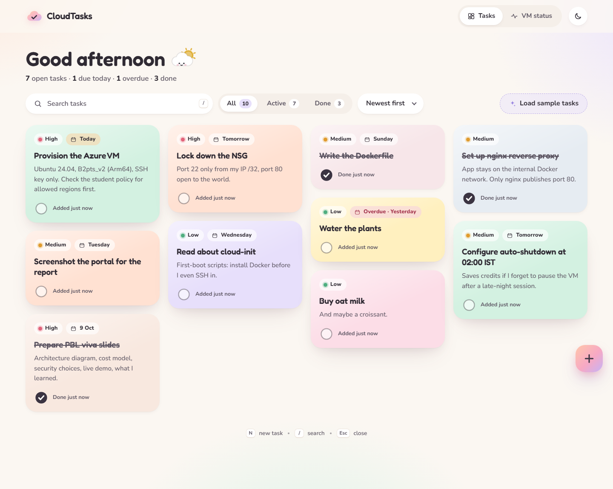
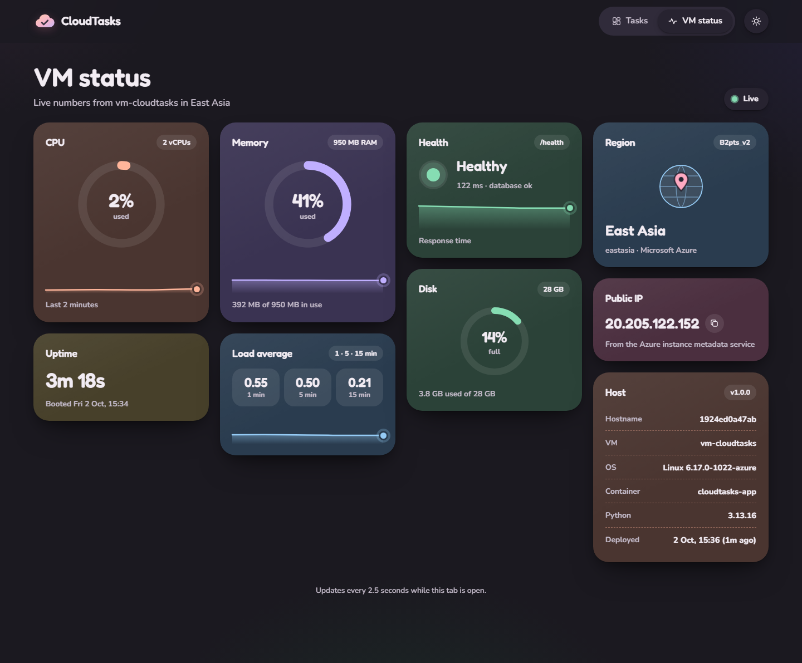
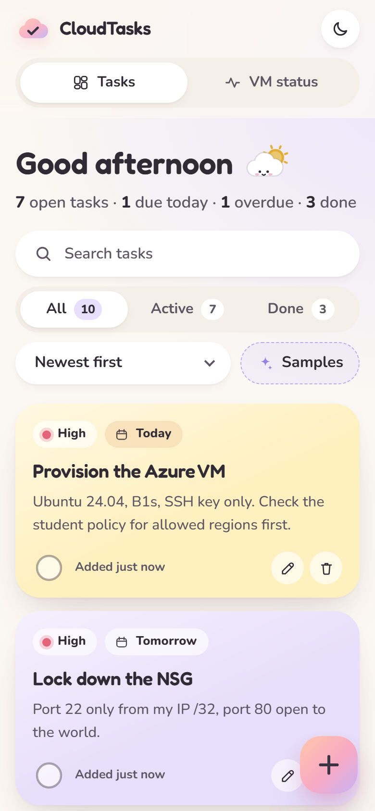
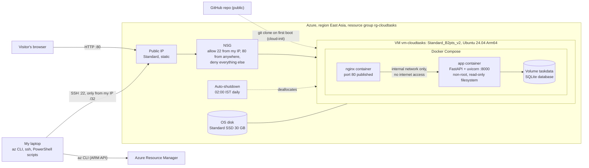

# CloudTasks on an Azure Linux VM

A soft, pastel task board with a live **VM status** panel, deployed to a publicly hosted Ubuntu VM on Microsoft Azure with Docker Compose and an nginx reverse proxy.

College cloud-computing PBL, project #16: *Deployment to a publicly hosted Linux VM on Azure*.

| Tasks (desktop) | VM status (desktop) |
|---|---|
|  |  |

| Dark theme | Mobile |
|---|---|
|  |  |

## What it is

- **Tasks**: create, edit, complete and delete tasks, each with a title (max 120 characters), optional note, priority (low / medium / high), optional due date and a pastel card colour. Cards sit in a masonry grid. Search, filters (All / Active / Done), sorting, undo on delete, and keyboard shortcuts: `N` new task, `/` search, `Esc` close.
- **VM status**: live CPU, memory, disk, load average, uptime, health and response time, refreshed every 2.5 seconds, plus region, VM size and public IP of the Azure VM.
- Light theme by default, a dark pastel theme as an option, works on phones, respects *reduced motion*.

## Architecture



**Request path:** browser → public IP → NSG (port 80 allowed) → nginx → app over a Docker network marked `internal` → SQLite file on a named volume. The app container has no published port and no route to the internet.

## Tech stack

| Layer | Choice |
|---|---|
| Backend | Python 3.13, FastAPI, uvicorn, SQLite (stdlib `sqlite3`), psutil |
| Frontend | One HTML page, plain CSS and JavaScript, self-hosted Fredoka and Nunito fonts, inline SVG charts; no CDN, no framework |
| Container | `python:3.13-slim`, non-root user, healthcheck; `nginx:1.30-alpine` reverse proxy |
| Cloud | Azure VM (IaaS), static public IP, network security group, managed disk, auto-shutdown, cloud-init |
| Automation | Azure CLI in PowerShell scripts, Playwright for screenshots, pytest |

## API

| Method and path | Purpose |
|---|---|
| `GET /api/tasks` | List tasks |
| `POST /api/tasks` | Create a task: `{title, note?, priority?, due_date?, color?}` |
| `PATCH /api/tasks/{id}` | Edit any field |
| `POST /api/tasks/{id}/toggle` | Toggle done |
| `DELETE /api/tasks/{id}` | Delete |
| `POST /api/tasks/sample` | Add 10 sample tasks |
| `GET /api/metrics` | CPU %, memory, disk, load average, uptime (psutil) |
| `GET /api/info` | OS, hostname, container, version, deploy time, Azure region / size / VM name / public IP |
| `GET /health` | `{"status": "ok", "database": "ok"}`, not rate limited |

`/api/*` is rate limited to **300 requests per minute per visitor IP**. One browser tab on the VM status view uses 26 per minute (about 9%), so about 11 tabs from the same IP can poll at once.

## Run it locally

Requirements: Docker Desktop (or Docker Engine with the Compose plugin).

```bash
docker compose up -d --build
# open http://localhost/       health check: http://localhost/health
docker compose down            # stop (the task database volume is kept)
```

Run the tests inside the same image the app uses:

```bash
docker build --target test .
```

Or with Python directly:

```bash
python -m venv .venv
.venv/Scripts/pip install -r requirements-dev.txt    # Linux/macOS: .venv/bin/pip
.venv/Scripts/python -m pytest -q
.venv/Scripts/python -m uvicorn app.main:app --port 8765
```

## Deploy to Azure

Requirements: Azure CLI logged in (`az login`), PowerShell 5.1 or 7, an OpenSSH client. The VM clones this public repository on first boot.

```powershell
./scripts/deploy.ps1 -PlanOnly    # checks + planned resources + cost per day; creates nothing
./scripts/deploy.ps1              # same, then asks you to type "yes" and creates everything
```

`deploy.ps1` does this:

1. **Checks** that you are logged in, reads the subscription's *Allowed resource deployment regions* policy, checks that auto-shutdown is supported in the region, and checks that the VM size is available to your subscription there. Subscription and tenant IDs are never printed.
2. **Shows the plan** with live prices from the Azure Retail Prices API and waits for `yes`.
3. **Creates** the resource group, a static public IP, an NSG (SSH only from your current IP /32, HTTP open), a VNet, and the VM (Ubuntu 24.04, SSH key only, a new ed25519 key that stays on your laptop), and enables auto-shutdown at 02:00 IST.
4. **cloud-init** on the VM installs Docker from Docker's official apt repository, adds 1 GiB swap, clones this repo, writes the non-secret `AZURE_*` values to `.env`, and runs `docker compose up -d --build`.
5. **Verifies** `http://<ip>/` and `/health` from your laptop and prints the URL.

### Day-to-day scripts and what each state costs

| Script | What it does | Cost per day afterwards |
|---|---|---|
| `scripts/start.ps1` | Starts the VM, re-pins the SSH rule to your current IP, waits, verifies, prints the URL | **0.477 USD** (running) |
| `scripts/pause.ps1` | Deallocates the VM: compute billing stops; disk, IP and tasks are kept | **0.199 USD** (disk + static IP) |
| `scripts/destroy.ps1` | Deletes the whole resource group after you type its name | **0 USD** |
| `scripts/update.ps1` | Pulls the latest commit on the VM and rebuilds the containers | unchanged |

Prices are pay-as-you-go for East Asia (October 2026): VM 0.0116 USD/hour, static public IP 0.005 USD/hour (charged even while the VM is stopped), Standard SSD E4 disk 2.40 USD/month. On Azure for Students these are charged to the free credit; no card is involved. Auto-shutdown deallocates the VM every night at 02:00 IST in case you forget to pause it.

## Why East Asia and B2pts_v2

The Azure for Students policy on this subscription allows five regions. Only one meets all three requirements:

| Region | Auto-shutdown supported | Cheap B-series sizes available to this subscription |
|---|---|---|
| **East Asia** | yes | **yes**: B2pts_v2, B2ats_v2, B2als_v2 |
| UAE North | yes | no, all blocked (`NotAvailableForSubscription`) |
| India South Central | no | yes |
| Malaysia West, Indonesia Central | no | no |

**Standard_B2pts_v2** (2 vCPU Arm64, 1 GiB RAM) is the cheapest available size at 0.0116 USD/hour; the x86 B2ats_v2 costs 0.0131 USD/hour. On the VM the whole stack uses about 55 MiB (app 43 MiB, nginx 11 MiB), and about 540 MB of memory stays free.

## Security

- **Network:** NSG allows SSH only from the deployer's IP /32 and HTTP from anywhere; everything else is denied. The app container is on an `internal` Docker network: no published port, no internet access. Only nginx is reachable.
- **Access:** SSH key authentication only, with password login disabled.
- **Containers:** the app runs as a non-root user (uid 10001) on a read-only filesystem with only the database volume writable, all Linux capabilities dropped, `no-new-privileges`, and memory, CPU and process limits. nginx is also read-only, with only the capabilities it needs. The Docker socket is never mounted.
- **Input and output:** strict validation (length limits, fixed lists for priority and colour, unknown fields rejected), SQL with bound parameters only, and every piece of user text rendered with `textContent` (never `innerHTML`). A strict Content-Security-Policy blocks inline scripts, plus `X-Frame-Options`, `nosniff` and `no-referrer` headers.
- **Rate limiting:** the visitor IP from `X-Real-IP` / `X-Forwarded-For` is trusted only when the request comes from nginx's fixed address on the internal network, so spoofed headers can't bypass the limit. nginx overwrites both headers.
- **No secrets:** none in the repo, the image or the logs. The `AZURE_*` values (region, size, VM name, public IP) are not secrets. `.gitignore` excludes keys, `.env`, databases and state files.

## Project layout

```
app/                 FastAPI app (main, db, schemas, system metrics/info, rate limiter) + static UI
tests/               API tests (pytest, 18 tests)
nginx/default.conf   reverse proxy configuration
Dockerfile           runtime image + "test" stage
docker-compose.yml   nginx + app, internal network, volume, limits
scripts/             deploy / start / pause / destroy / update (PowerShell), cloud-init, screenshots
docs/                report.md (PBL report) and screenshots/
```

## Licence notes

Fredoka and Nunito are used under the SIL Open Font License 1.1 (see `app/static/fonts/LICENSE.txt`).
