# PBL Report: Deployment to a Publicly Hosted Linux VM on Azure

**Project #16, Cloud Computing.** Application: *CloudTasks*, a task tracker with a live VM status panel.
Live URL: **https://tasks.devanshlamba.in** (invite-only; a read-only demo account is available) · Code: `https://github.com/devanshlamba/azure-vm-deploy`

The project was built in two phases. **Phase 1** deployed the app over HTTP on the VM's public IP with a nightly auto-shutdown. **Phase 2** added a domain with HTTPS (Let's Encrypt via Caddy), invite-only accounts, a read-only demo account and 24/7 hosting. Sections describe the current (phase 2) state unless they say otherwise.

> **PENDING (draft status).** Still to be completed before submission:
> 1. Azure portal screenshots, Section 10.4 (being captured).
> 2. The paused state: `pause.ps1` output and the portal's *Stopped (deallocated)* view, Section 10.5.
> 3. The billed cost from Cost Analysis, Section 7 (Azure reports usage 8–24 hours late).
> 4. Section 9, *What I learned*, rewritten in my own words.

---

## 1. Objective

Build a real, small web application and deploy it to a Linux virtual machine on Microsoft Azure that anyone on the internet can reach, while:

- using **Infrastructure as a Service (IaaS)** directly: I create and manage the VM, network and firewall myself rather than using a managed platform;
- automating the whole deployment with the **Azure CLI** in repeatable scripts (deploy, pause, start, destroy);
- packaging the application in **containers** behind an **nginx reverse proxy**, with data on a **persistent volume**;
- applying sensible **security** (key-only SSH, a minimal firewall, no secrets, a hardened container); and
- keeping it **free**: Azure for Students credit only, no credit card, with a clear **cost model** for running, paused and deleted states.

## 2. Cloud concepts used

| Concept | What it means | Where it appears in this project |
|---|---|---|
| **IaaS** | The cloud provider runs the physical hardware; I manage the OS and everything above it. | I chose the OS image (Ubuntu 24.04), installed Docker, and run and patch the stack myself. |
| **Virtual machine** | A software-defined computer with a chosen number of vCPUs, amount of RAM and disk, billed per hour while it runs. | `vm-cloudtasks`, size `Standard_B2pts_v2` (2 vCPU Arm64, 1 GiB RAM), a burstable B-series size suited to mostly idle web apps. |
| **Region and policy** | Data-centre location; organisations can restrict which regions may be used. | Azure for Students allows only five regions. The script reads that policy and picks **East Asia** (Section 4). |
| **Public IP** | An internet-routable address attached to the VM's network interface. | `pip-cloudtasks`, Standard SKU, **static**, so the URL survives stop/start. |
| **NSG (network security group)** | A stateful firewall of allow/deny rules attached to a NIC or subnet. | Allows **22 only from my IP /32** and **80 from anywhere**; Azure's default rules deny all other inbound traffic. |
| **SSH keys** | Public-key authentication: the VM holds the public key, my laptop keeps the private key. | A new ed25519 key per project; password login disabled (verified: `disablePasswordAuthentication = true`). |
| **cloud-init** | A first-boot script that configures a fresh VM. | Installs Docker, adds swap, clones the repo, writes metadata and starts the containers, with no manual SSH steps. |
| **Containers** | An app packaged with its dependencies into an image that runs isolated on a shared kernel. | The app image (`python:3.13-slim`, non-root) and `nginx:1.30-alpine`, both run by **Docker Compose**. |
| **Reverse proxy** | A server in front of the app that receives client traffic and forwards it. | nginx is the only published service (port 80); it forwards to the app over an internal network and sets the client-IP headers. |
| **Persistent volume** | Storage that outlives the container. | Named volume `taskdata` holds the SQLite database; tasks survive rebuilds, restarts and VM stop/start. |
| **Managed disk** | The VM's virtual disk, billed per month by size and tier. | Standard SSD, 30 GB (billed as E4). |
| **Cost model** | Pay-as-you-go per resource; deallocating stops compute charges but not storage or IP charges. | Running / paused / destroyed costs in Section 7, with live prices pulled from the Azure Retail Prices API. |
| **Auto-shutdown** | A schedule that deallocates the VM at a fixed time. | Phase 1: 02:00 IST every day, a safety net against forgotten VMs. Removed in phase 2 for 24/7 hosting; a $10 budget alert replaces it as the safety net. |
| **DNS** | Maps a name to an IP address. | Cloudflare hosts `devanshlamba.in`; an **A record** `tasks` → `20.205.122.152`, *DNS only* (no proxy), so visitors connect straight to the VM. |
| **TLS / HTTPS** | Encrypts and authenticates the connection with a certificate from a trusted authority. | Caddy gets a free **Let's Encrypt** certificate automatically (ACME) and renews it about 30 days before expiry; HTTP redirects to HTTPS; HSTS. |
| **Authentication and sessions** | Proving who a user is, then remembering it safely. | argon2id password hashes, server-side sessions in an HttpOnly/Secure cookie, CSRF tokens (Section 5.1). |
| **Cost alerting** | Azure Cost Management budgets send e-mails at spending thresholds. | `cloudtasks-budget`: 10 USD/month, alerts at 50% and 100% actual and 100% forecast. |

## 3. Architecture

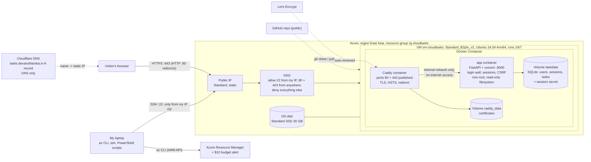

**Azure resources** (all in `rg-cloudtasks`, so one command deletes everything): virtual machine, OS disk, NIC, public IP, NSG, and VNet `10.20.0.0/24` with subnet `10.20.0.0/26`. Phase 1 also had an auto-shutdown schedule (`Microsoft.DevTestLab/schedules`), removed in phase 2. The subscription also has the budget `cloudtasks-budget`.

**Application:**
- **Backend:** FastAPI on uvicorn with SQLite. The task API supports create, list, edit, toggle and delete. The status API reports CPU, RAM, disk, load and uptime via psutil.
- **Frontend:** one HTML page in plain JavaScript and CSS, with self-hosted fonts and inline SVG gauges and sparklines. It loads nothing from external sites.

**Request flow:** browser → `tasks.devanshlamba.in` (Cloudflare DNS, *DNS only*) → public IP → NSG (443 allowed; 80 only redirects) → Caddy container (TLS) → app container over a Docker network marked `internal` → SQLite on the `taskdata` volume. In phase 1 an nginx container did Caddy's job on port 80 only.

## 4. Implementation steps

1. **Application and tests.** Built the API with strict validation, the UI, and 18 automated API tests (pytest). Took screenshots with Playwright and refined the design based on them.
2. **Containers locally.**
   - **Dockerfile:** `python:3.13-slim` base, non-root user, healthcheck, plus a separate `test` stage so `docker build --target test .` runs the tests inside the image.
   - **Compose:** nginx on port 80; the app on an internal network; read-only filesystems, memory/CPU/process limits, restart always.
   - **Local checks:** verified the security properties (see Section 6).
3. **Choosing a region and size.** The script reads the student policy instead of guessing:

   | Allowed region | Auto-shutdown supported | Cheap B-series sizes available to my subscription |
   |---|---|---|
   | **East Asia** | yes | **yes**: B2pts_v2, B2ats_v2, B2als_v2 |
   | UAE North | yes | no, all `NotAvailableForSubscription` |
   | India South Central | no | yes |
   | Malaysia West, Indonesia Central | no | no |

   East Asia is the only region that satisfies both requirements. **Standard_B2pts_v2** is the cheapest size available there at 0.0116 USD/hour; the x86 B2ats_v2 costs 0.0131 USD/hour. Before choosing ARM, I confirmed that every component has an arm64 build: the Ubuntu image, both container base images and psutil.
4. **Deployment** (`scripts/deploy.ps1`).
   - Pre-flight checks, then the plan and cost per day; the script waits for an explicit `yes`.
   - Creates the resources with the Azure CLI. cloud-init then installs Docker from Docker's apt repository, clones the repo and runs `docker compose up -d --build`.
   - Total time from `yes` to a verified site: about **5 minutes**.
5. **Verification from my laptop.**
   - `http://20.205.122.152/` returned 200 with the page, and `/health` returned `{"status":"ok","database":"ok"}`.
   - The VM status tab showed the real region, size, VM name and IP. Port 8000 was unreachable from outside.
6. **Operations.**
   - `pause.ps1` (deallocate), `start.ps1` (start, re-pin the SSH rule to my current IP, verify).
   - `update.ps1` (git pull on the VM and rebuild; used once to ship a fix).
   - `destroy.ps1` (delete the resource group after typing its name).
7. **Phase 2: HTTPS, accounts and 24/7 hosting.**
   - Replaced nginx with **Caddy**, which obtains and renews the Let's Encrypt certificate itself and redirects HTTP to HTTPS.
   - Added **invite-only accounts** (users and sessions tables, a versioned database migration that deleted the old ownerless sample tasks), a sign-in page, a user chip with sign-out, and a **read-only demo** account.
   - Added the **Cloudflare A record** (`tasks` → the static IP, *DNS only*), then ran `update.ps1`: it opened port 443, removed auto-shutdown, pulled the code, rebuilt, and verified HTTPS from my laptop (Listing 4).
   - Created the admin and demo accounts with the user CLI over SSH, typing the passwords at a hidden prompt (Listing 6).
   - Turned on HSTS after HTTPS was verified, created the 10 USD budget, and tested a full VM reboot (Listings 7–9).

## 5. Security choices

| Area | Choice | Why |
|---|---|---|
| Firewall | NSG: SSH only from my IP /32, HTTP and HTTPS from anywhere, default deny. `start.ps1` updates the SSH rule if my IP changes. | Shrinks the attack surface; bots constantly scan port 22 on public IPs. |
| Login | SSH key only (ed25519); password authentication disabled. | Rules out password brute-force. The private key never leaves my laptop and is excluded by `.gitignore`. |
| Network isolation | App container on an `internal: true` Docker network: no published port, no internet access. | Only nginx is reachable. Without internet access, the app couldn't send data out even if it were compromised. |
| Container hardening | Non-root user (uid 10001), read-only filesystem (only the database volume writable), all Linux capabilities dropped, `no-new-privileges`, memory/CPU/process limits; nginx is also read-only with minimal capabilities; the Docker socket is never mounted. | Limits what an attacker could do inside a container. |
| Input validation | Pydantic models: title 1–120 characters, note ≤ 500, priority and colour from fixed lists, valid dates, unknown fields rejected, control characters stripped. | Bad input is rejected before it reaches the database. |
| SQL injection | Bound parameters only; the column names used in updates come from a fixed allowlist. | User input can never become SQL. |
| XSS | All user text is rendered with `textContent`, never `innerHTML`. A Content-Security-Policy allows scripts only from the site itself, with no inline scripts. Plus `X-Frame-Options: DENY`, `nosniff`, `no-referrer`. | Even a task titled `` is shown as plain text (there is a test for this). |
| Rate limiting | 300 requests/min per visitor IP on `/api`. The `X-Real-IP` / `X-Forwarded-For` headers are trusted only from nginx's fixed address (`172.28.0.10/32`); nginx overwrites them. | Spoofed headers can't bypass the limit. Tested: 125 requests through nginx, each with a different fake IP header, gave exactly 120 allowed and 5 blocked (measured while the limit was 120). |
| Secrets | Nothing secret in code, image, git history or logs. Subscription and tenant IDs are never printed: every `az` query selects only the needed fields, and `az rest` fills in the subscription ID itself. | The repository is public. |
| HTTPS | Let's Encrypt certificate via Caddy, automatic renewal, HTTP → HTTPS (308), `Strict-Transport-Security: max-age=31536000` (enabled only after HTTPS was verified; no `includeSubDomains`). | Passwords and session cookies must never cross the network in clear text. |
| Honest metadata | Region, size, VM name and IP are passed in as non-secret environment variables by the deploy script; `/api/info` reports `metadata_source: "deploy"` and the UI says "Set at deploy time from Azure". | The app has no internet access, so it can't call Azure's instance metadata service (IMDS), and IMDS doesn't return Standard-SKU public IPs anyway. |

### 5.1 Authentication, sessions and access control (phase 2)

| Area | Choice | Why |
|---|---|---|
| Sign-up | None: invite-only. Accounts are created on the VM with `python -m app.manage_users`; passwords are typed at a hidden `getpass` prompt, never as arguments. | A personal board on the public internet; no spam accounts; passwords never in shell history. |
| Passwords | argon2id (argon2-cffi, OWASP parameters: 19 MiB, 2 iterations), minimum 12 characters. | Memory-hard hashing makes offline guessing expensive; the parameters fit the 256 MiB container. |
| Sessions | 256-bit random token in a `__Host-ct_session` cookie: HttpOnly, Secure, SameSite=Lax, 7 days. The database stores only HMAC-SHA256(secret, token); the secret is generated on the VM (mode 0600). Logout and password resets delete the sessions. | JavaScript can't read the cookie, it only travels over HTTPS, and a stolen database can't be used to log in. Server-side sessions can really be revoked. |
| CSRF | Per-session token required in `X-CSRF-Token` on every write (constant-time comparison) + `Origin` must match the site, also on sign-in. | Another website can't make a signed-in browser change data. |
| Sign-in abuse | Generic error ("Wrong username or password."), a dummy hash check for unknown usernames, 10 failures per IP and 5 per username per 15 minutes, 1 s delay on failures. The demo account has no per-username lockout. | No user enumeration; slows guessing. Locking the public demo username would only let strangers lock everyone out. |
| Authorisation | Every page and `/api` route needs a session (401 / redirect to `/login`); every task query filters by the signed-in user's ID; the demo role gets 403 on every write and has a stricter limit (60 requests/min per IP). `/health` stays public but returns only `{"status": "ok"}`. | Users can't see or change each other's tasks (tested); the public demo login can't be used for vandalism. |

**Threat model (short).**

| Protected against | How |
|---|---|
| Eavesdropping / tampering in transit | HTTPS everywhere, HSTS |
| Strangers reading or changing tasks | Login wall; per-user queries |
| One user reading another user's tasks | `user_id` filter in every query (automated test) |
| Password guessing | argon2id, per-IP and per-username limits, failure delay |
| Stolen copy of the database | Only password hashes and keyed token hashes are stored |
| CSRF, clickjacking, XSS | CSRF token + Origin check, SameSite, `frame-ancestors 'none'`, `textContent`, strict CSP |
| Vandalism via the public demo login | Read-only demo role, stricter rate limit |

| Not protected against (accepted) | Why / mitigation |
|---|---|
| A compromised VM or Azure account | Out of scope; SSH is key-only and limited to one IP |
| Large denial-of-service attacks | No CDN or WAF (Cloudflare proxy is off); per-IP limits help only partly |
| Reused or phished passwords | No MFA; invite-only and a 12-character minimum reduce the risk |
| Data loss | No backups yet |
| Limit counters after a restart | Kept in memory, so a restart resets them |

## 6. Testing and measurements

| Check | Result |
|---|---|
| Automated tests | **41 passed**, locally and inside the Docker `test` stage. Phase 1: validation, create/edit/toggle/delete, 404s, XSS and security headers, sample tasks, metrics/info, metadata source, rate limiting, trusted-proxy handling, hostname. Phase 2: sign-in success/failure (same message), the failure delay, cookie flags, 401 without a session, user isolation, read-only demo (403 on every write), demo rate limit, CSRF (missing/wrong token, foreign Origin, sign-in from another site), per-IP and per-username limits with the demo exception, logout revocation, session expiry, hashes never returned (API and CLI), argon2id + password policy, the migration, cascading deletes, HEAD requests. |
| Docker isolation (local) | App port 8000 not reachable from the host; app has no internet access (DNS fails); app runs as uid 10001; writing outside `/data` fails ("Read-only file system"); tasks survived `docker compose down` / `up`. |
| Images | App image 238 MB on the VM, of which about 190 MB is the Python slim base; nginx 93 MB (phase 1), replaced by Caddy in phase 2. |
| Memory on the 1 GiB VM | Phase 1: app 43 MiB, nginx 11 MiB. Phase 2: app 41 MiB, Caddy 15 MiB, about 530 MB still available. Building the image on the VM used at most 42 MB of swap, with no out-of-memory kills. |
| Polling load | One VM status tab sends 24 `/api/metrics` + 1 `/api/info` + 1 `/api/tasks` + 1 `/api/auth/me` per minute: about **27 of 300** (9%), or 27 of 60 for the demo account. `/health` (24/min) is not rate limited. |
| HTTPS checks | Valid Let's Encrypt certificate, HTTP → HTTPS 308, `/api/*` 401 without a session, HSTS header present (Listings 4, 5, 8). |
| Reboot test | VM restarted through Azure: the site answered again after about 45 seconds, both containers restarted on their own, the certificate and the accounts survived (Listing 7). |
| Compression | `app.js` is 41 KB uncompressed and 14.8 KB gzipped by nginx. |
| Response time | About 110–130 ms for `/health` from my laptop in India to East Asia. |
| Screenshots | Desktop and mobile, light and dark, both views, taken from the live site with Playwright (`docs/screenshots/live-*.png`), with no browser console errors. |

## 7. Cost

Pay-as-you-go prices for East Asia, read from the Azure Retail Prices API on 2 October 2026:

| Resource | Price | Per day |
|---|---|---|
| VM Standard_B2pts_v2 (Linux) | 0.0116 USD/hour | 0.278 USD |
| Public IP, Standard static | 0.005 USD/hour (also while the VM is stopped) | 0.120 USD |
| OS disk, Standard SSD E4 (30 GB) | 2.40 USD/month | 0.079 USD |
| NSG, VNet, NIC, budget | free | 0 |

| State | How to get there | USD/day | USD/month |
|---|---|---|---|
| **Running** | `deploy.ps1` or `start.ps1` | **0.477** | 14.51 |
| **Paused (deallocated)** | `pause.ps1` (phase 1 also: auto-shutdown at 02:00 IST) | **0.199** | 6.05 |
| **Destroyed** | `destroy.ps1` | **0** | 0 |

**Real cost.** The VM was created on 2 October 2026 at 10:04 UTC. By the time this report was written (about 1.5 hours later), the expected charge was about **0.03 USD**: 1.5 h × (0.0116 + 0.005) USD/hour + 1.5 h of disk. Azure shows billed usage 8–24 hours late. The final figure comes from *Cost Management → Cost analysis*, filtered to `rg-cloudtasks`.

> **PENDING:** billed cost for the project period, from Cost Management → Cost analysis: **_____ USD**, for the period **_____ to _____**.

All charges come out of the Azure for Students credit; no credit card is linked. Since phase 2 the VM runs **24/7: about 0.48 USD/day or 14.5 USD/month, so 100 USD of credit lasts about 209 days (until about the end of April 2027)**. The budget `cloudtasks-budget` (10 USD/month) e-mails at 50% and 100% of actual cost and at 100% of forecast cost (Listing 9). The domain was already owned, so HTTPS added no cost: Let's Encrypt certificates and Cloudflare DNS are free.

## 8. Limitations

- *Fixed in phase 2:* the site was HTTP only (now HTTPS with HSTS) and everyone shared one board (now invite-only accounts with per-user tasks).
- **No MFA, no self-service password reset.** Accounts are managed by hand with the CLI.
- **No CDN or WAF.** Cloudflare is used for DNS only, so traffic goes straight to the VM; a large attack could overwhelm it.
- **In-memory limits.** Rate-limit and sign-in counters live in one process and reset when the app restarts.
- **Single VM, single app process.** No redundancy or load balancing. The rate limiter keeps its counters in one process's memory and loses them on restart. Restarts or VM maintenance cause downtime.
- **SQLite on the VM's OS disk.** Data is lost when the resource group is destroyed, and there are no backups. A managed database or disk snapshots would fix that.
- **Shared IP addresses.** Many people behind one NAT (for example a college network) share the 300-requests-per-minute budget (60 for the demo account). About 11 VM status tabs (2 for the demo) can poll at the same time from one IP.
- **The paused state still costs money**, because the Standard static IP is billed while the VM is stopped. Running 24/7 uses up the student credit in about 7 months.
- **HSTS is a commitment.** Browsers now insist on HTTPS for this name for a year; going back to HTTP would require waiting that out.
- **The SSH rule depends on my IP.** If my ISP changes my IP, SSH is blocked until `start.ps1` (or a manual rule update) re-pins it.
- **No Trusted Launch.** The VM uses the `Standard` security type: the Azure CLI default didn't enable Trusted Launch for this Arm64 VM.
- **The image is built on the VM.** That takes a few minutes on a small burstable VM. A container registry with a prebuilt arm64 image would make deployments faster and more reproducible.

## 9. What I learned

> **PENDING:** the points below are notes drafted from what happened during the build. Rewrite them in your own words before submitting.

- **Student policies shape the architecture.** The region I would have picked first (close to India) wasn't allowed. Of the allowed ones, only East Asia had both auto-shutdown support and VM sizes my subscription could use. Checking `az vm list-skus` restrictions per subscription, not just the region list, saved a failed deployment.
- **"Stopped" is not "deallocated", and deallocated isn't free.** Only deallocation stops VM billing. Disks and Standard static IPs keep costing money, which is why my paused state still costs 0.199 USD/day.
- **ARM is a real option for small workloads.** It was the cheapest size available; the only extra work was checking that every image and Python package had an arm64 build.
- **Defence in depth works in layers.** The NSG decides who reaches the VM, nginx is the only door into Docker, the internal network keeps the app off the internet, and the container itself is non-root and read-only. Each layer still helps if another one fails.
- **Trusting proxy headers is a trap.** Accepting `X-Forwarded-For` from anyone would let attackers bypass the rate limit just by changing a header. Trusting it only from nginx's fixed IP, and testing that, closed the gap.
- **Hardening has side effects.** Cutting the app off from the internet also cut it off from Azure's metadata service. I solved that by passing non-secret values in from the deploy script and labelling their source honestly in the UI.
- **Windows tooling quirks matter for automation.** `az` on Windows runs through `cmd.exe`, which cut a URL at its `&`, and PowerShell 5.1 stripped quotes inside SSH commands. Running the scripts for real, not just writing them, exposed both bugs.
- **Automation makes the cloud cheap to experiment with.** One command deploys, one pauses, one destroys, and every step is verified from outside the VM.

## 10. Evidence

All evidence comes from the real deployment on 2 October 2026. Images were checked one by one: no subscription ID, tenant ID, password or home IP address appears in any of them. In terminal output, the deployer's home IP is replaced with `<home-ip-masked>`; nothing else was changed.

### 10.1 Live site with the address bar

Captured from a real Chromium window with the Win32 `PrintWindow` API (`scripts/window_screenshots.py`), so the address bar is included.

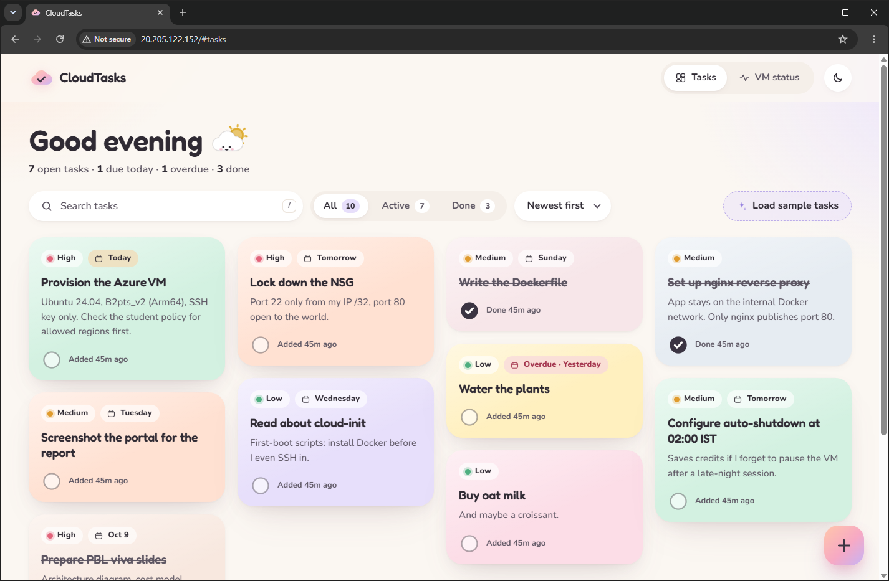
*Figure 1: Tasks view on the live VM, address bar showing `20.205.122.152/#tasks` ("Not secure" because the site is HTTP only, see Section 8).*

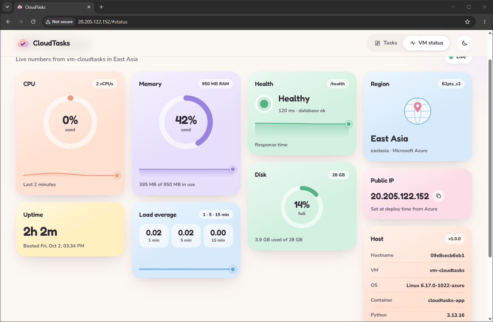
*Figure 2: VM status panel (heading scrolled under the top bar)*

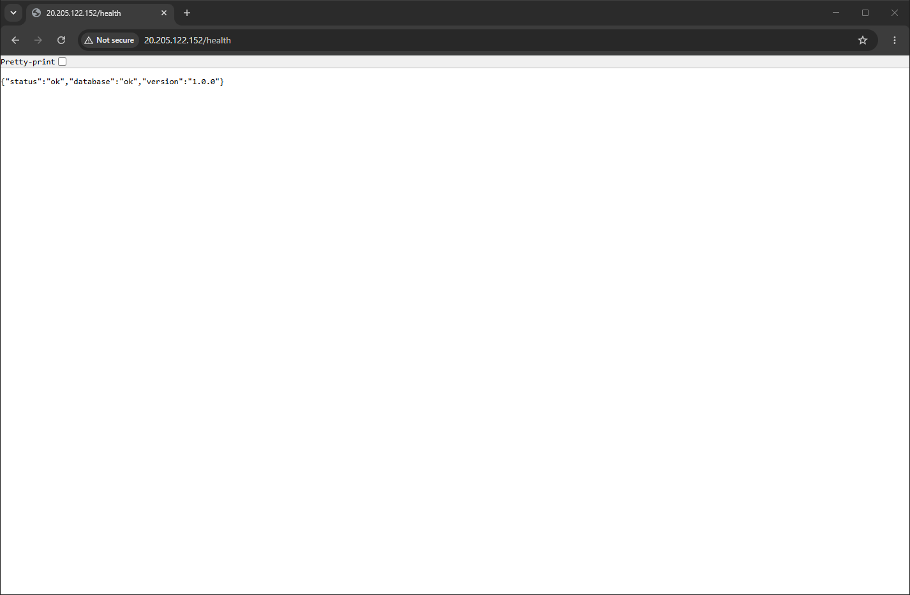
*Figure 3: The public `/health` endpoint returning `{"status":"ok","database":"ok","version":"1.0.0"}`.*

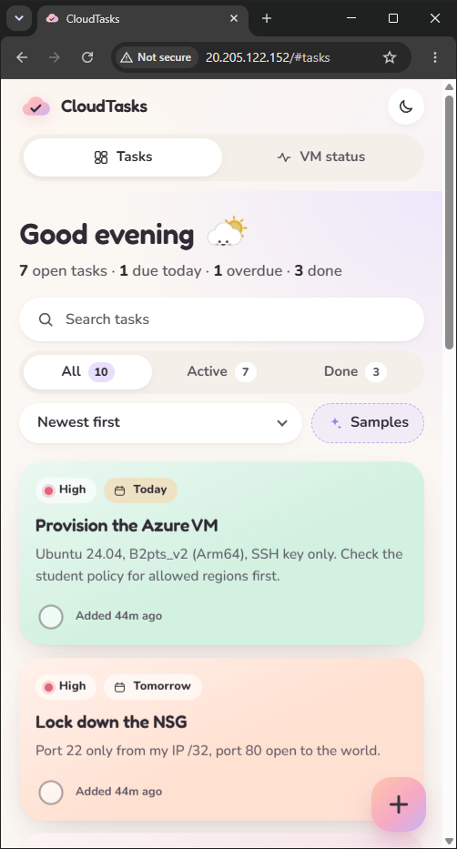
*Figure 4: Mobile layout in a narrow (about 500 px) browser window, the smallest width Chromium allows: one column of cards.*

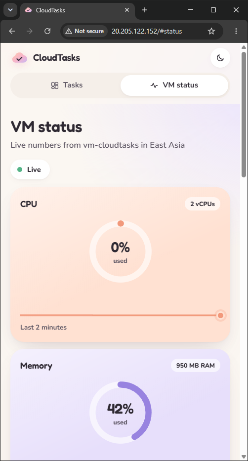
*Figure 5: VM status in the same narrow window.*

### 10.2 Full-page views (light and dark)

Captured with Playwright from the live site (`scripts/screenshots.py`), with no browser console errors.

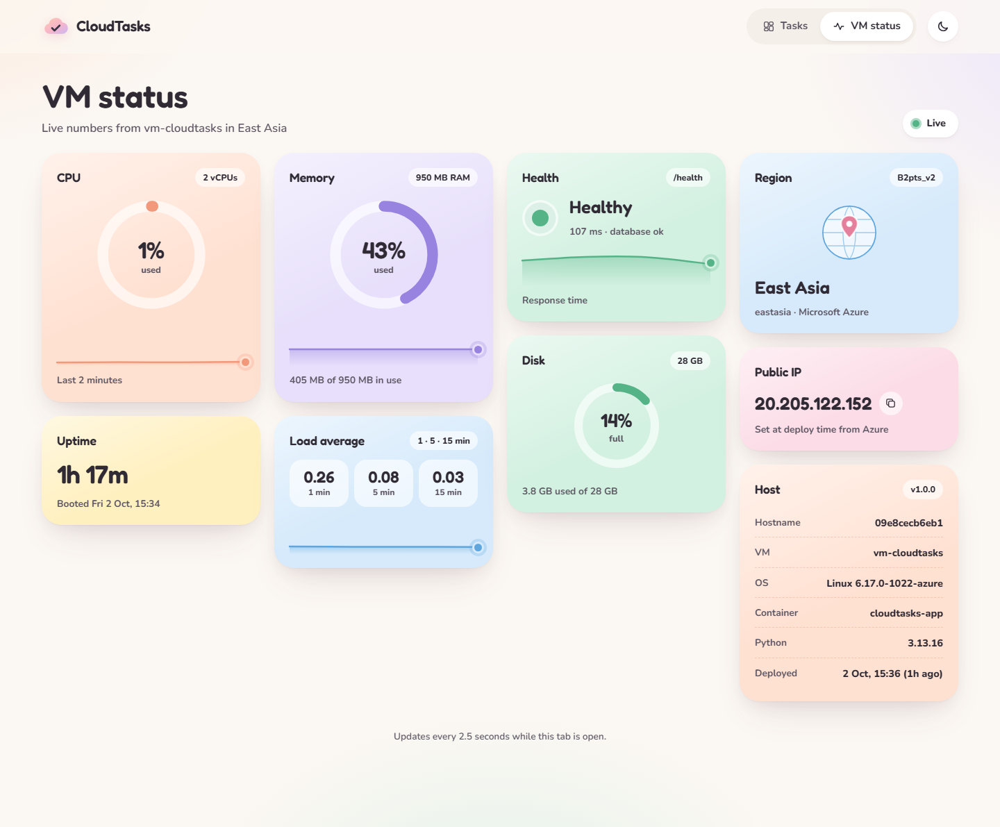
*Figure 6: VM status, light theme: real region (East Asia), VM size (B2pts_v2) and public IP, labelled "Set at deploy time from Azure".*

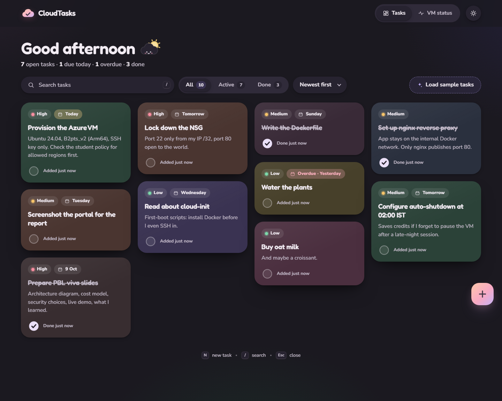
*Figure 7: Task board, dark theme: masonry grid, priorities, due-date chips, done tasks with strike-through.*

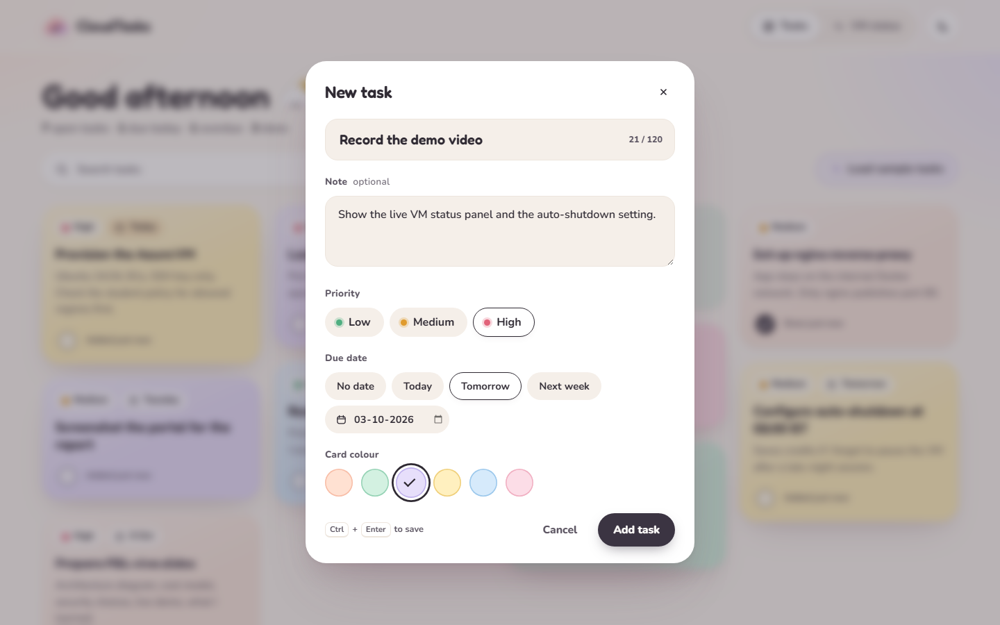
*Figure 8: The add-task dialog with priority, due date and card colour.*

| Other captures in `docs/screenshots/` | Shows |
|---|---|
| `live-desktop-light-tasks.png`, `live-desktop-dark-status.png` | The two views in the other theme |
| `live-mobile-{light,dark}-{tasks,status}.png` | Mobile, both views, both themes |
| `live-desktop-light-empty.png` | Empty state before the sample tasks were loaded |
| `live-mobile-light-composer.png` | Add-task bottom sheet on mobile |

### 10.3 Terminal evidence

*Listing 1: `./scripts/deploy.ps1 -PlanOnly`, run against the existing deployment on 2 October 2026 at 11:38 UTC (home IP masked).*

```text
==> Checking Azure login
    OK  Logged in, subscription: Azure for Students
    Note: 'rg-cloudtasks' already exists (deployed). Showing the plan for reference only.

==> Checking the subscription policy (allowed regions)
    Allowed regions: eastasia, malaysiawest, uaenorth, indonesiacentral, indiasouthcentral
    OK  eastasia is allowed

==> Checking that auto-shutdown works in this region
    OK  Auto-shutdown is supported in East Asia

==> Checking that Standard_B2pts_v2 is available to this subscription in eastasia
    OK  Standard_B2pts_v2 is available (no restrictions)

==> Finding your current public IP (for the SSH rule)
    OK  SSH (22) will be allowed only from <home-ip-masked>/32

==> Fetching live prices (Azure Retail Prices API)

PLANNED RESOURCES  (region: eastasia / East Asia)

Resource        Name                             Details                                                 USD/day
--------        ----                             -------                                                 -------
Resource group  rg-cloudtasks                    container for everything below                          0      
Virtual machine vm-cloudtasks                    Standard_B2pts_v2, Ubuntu 24.04 Arm64, SSH key only     0.278  
OS disk         vm-cloudtasks-osdisk             StandardSSD_LRS 30 GB (E4)                              0.079  
Public IP       pip-cloudtasks                   Standard SKU, static IPv4                               0.120  
NSG             nsg-cloudtasks                   22 from <home-ip-masked>/32, 80 from anywhere, rest denied 0      
VNet + subnet   vnet-cloudtasks                  10.20.0.0/24, subnet 10.20.0.0/26                       0      
NIC             vm-cloudtasksVMNic               attached to VM, NSG and public IP                       0      
Auto-shutdown   shutdown-computevm-vm-cloudtasks 02:00 IST (20:30 UTC) every day                         0      


State                               USD / day  USD / month
Running (VM + disk + IP)                0.477        14.51
Paused / deallocated (disk + IP)        0.199         6.05
Destroyed (resource group deleted)      0.000         0.00

Prices: VM 0.0116 USD/h, public IP 0.005 USD/h, disk 2.4 USD/month. Billed to your Azure for Students credit (no card).
Outbound data: first 100 GB/month free. Auto-shutdown deallocates the VM at 02:00 IST, so the VM part stops being billed overnight.

Plan only: nothing was created.
```

*Listing 2: `sudo docker ps` on the VM over SSH, 2 October 2026, 11:38 UTC.*

```text
azureuser@vm-cloudtasks:~$ sudo docker ps
CONTAINER ID   IMAGE                  COMMAND                  CREATED          STATUS                    PORTS                                 NAMES
09e8cecb6eb1   cloudtasks-app:1.0.0   "uvicorn app.main:ap…"   16 minutes ago   Up 16 minutes (healthy)   8000/tcp                              cloudtasks-app
d048df130e2f   nginx:1.30-alpine      "/docker-entrypoint.…"   2 hours ago      Up 2 hours (healthy)      0.0.0.0:80->80/tcp, [::]:80->80/tcp   cloudtasks-nginx
```

*Listing 3: `sudo docker compose ps` in `/opt/cloudtasks` on the VM, 2 October 2026, 11:38 UTC. Both containers healthy; only nginx publishes a port (80); the app's 8000 is internal.*

```text
azureuser@vm-cloudtasks:/opt/cloudtasks$ sudo docker compose ps
NAME               IMAGE                  COMMAND                  SERVICE   CREATED          STATUS                    PORTS
cloudtasks-app     cloudtasks-app:1.0.0   "uvicorn app.main:ap…"   app       16 minutes ago   Up 16 minutes (healthy)   8000/tcp
cloudtasks-nginx   nginx:1.30-alpine      "/docker-entrypoint.…"   nginx     2 hours ago      Up 2 hours (healthy)      0.0.0.0:80->80/tcp, [::]:80->80/tcp
```

### 10.4 Azure portal

Captured from the Azure portal in a browser window. Subscription ID, tenant ID, email address and home IP are masked before every capture.

> **PENDING:** screenshot (a): Resource group `rg-cloudtasks` → Overview, showing all 7 resources in East Asia.
*Figure 9: (a) Resource group `rg-cloudtasks` → Overview.*

> **PENDING:** screenshot (b): Virtual machine `vm-cloudtasks` → Overview, showing status *Running*, size Standard B2pts v2, Ubuntu 24.04, public IP.
*Figure 10: (b) Virtual machine `vm-cloudtasks` → Overview.*

> **PENDING:** screenshot (c): Network security group `nsg-cloudtasks` → Inbound security rules, showing `AllowSshFromMyIp` (22, home IP masked), `AllowHttp` (80), default deny rules.
*Figure 11: (c) Network security group `nsg-cloudtasks` → Inbound security rules.*

> **PENDING:** screenshot (d): VM → Operations → Auto-shutdown, showing enabled daily at 02:00 IST.
*Figure 12: (d) VM → Operations → Auto-shutdown.*

> **PENDING:** screenshot (e): OS disk `vm-cloudtasks-osdisk` → Overview, showing Standard SSD, 30 GiB.
*Figure 13: (e) OS disk `vm-cloudtasks-osdisk` → Overview.*

> **PENDING:** screenshot (f): Public IP `pip-cloudtasks` → Overview, showing SKU Standard, static, 20.205.122.152.
*Figure 14: (f) Public IP `pip-cloudtasks` → Overview.*

> **PENDING:** screenshot (g): VM → Monitoring → Metrics, showing *Percentage CPU* chart.
*Figure 15: (g) VM → Monitoring → Metrics.*

> **PENDING:** screenshot (h): Azure Policy → Assignments, showing *Allowed resource deployment regions* with the five allowed regions.
*Figure 16: (h) Azure Policy → Assignments.*

> **PENDING:** screenshot (i): Cost Management → Cost analysis (scope `rg-cloudtasks`), showing accumulated cost; may still be empty until Azure reports usage.
*Figure 17: (i) Cost Management → Cost analysis (scope `rg-cloudtasks`).*

### 10.6 Phase 2: HTTPS, accounts and 24/7 (2 October 2026)

All outputs below are real. Each listing says exactly what was shortened.

*Listing 4: `./scripts/update.ps1` migrating the live VM, about 12:50 UTC (the certificate was issued at 12:49). Shortened: the `git pull` file list and the progress dots are omitted.*

```text
==> Network: HTTPS rule and 24/7 hosting
    OK  Added NSG rule AllowHttps (443 from Internet)
    OK  Removed the daily auto-shutdown schedule (the VM now runs 24/7)

==> Updating the configuration and code on 20.205.122.152
968d8c9 Merge feature/https-auth: HTTPS, invite-only accounts, read-only demo, 24/7 hosting
 Container cloudtasks-app Starting
 Container cloudtasks-app Started
 Container cloudtasks-app Waiting
 Container cloudtasks-app Healthy
 Container cloudtasks-caddy Starting
 Container cloudtasks-caddy Started
HOST_NAME=vm-cloudtasks
SITE_ADDRESS=tasks.devanshlamba.in
CANONICAL_URL=https://tasks.devanshlamba.in
HSTS_MAX_AGE=0

==> Verifying from this laptop
    OK  tasks.devanshlamba.in resolves to 20.205.122.152
    OK  Valid certificate for tasks.devanshlamba.in from YE2, expires 31 Dec 2026 (89 days left)
    OK  http://tasks.devanshlamba.in redirects to HTTPS (308)
    OK  https://tasks.devanshlamba.in/login returns the sign-in page
    OK  https://tasks.devanshlamba.in/api/tasks without a session -> 401
    OK  https://tasks.devanshlamba.in/health -> status=ok

Updated: https://tasks.devanshlamba.in/
```

*Listing 5: the certificate, read with `openssl s_client` and `openssl x509 -noout -issuer -subject -dates`. YE2 is a Let's Encrypt intermediate.*

```text
issuer=C=US, O=Let's Encrypt, CN=YE2
subject=CN=tasks.devanshlamba.in
notBefore=Oct  2 12:49:28 2026 GMT
notAfter=Dec 31 12:49:27 2026 GMT
```

*Listing 6: `manage_users list` on the VM after the two accounts were created (passwords typed by me at a hidden prompt). No hashes are shown.*

```text
USERNAME             ROLE    TASKS  CREATED (UTC)
devansh              admin       0  2026-10-02T13:59:22+00:00
demo                 demo       10  2026-10-02T13:59:44+00:00
```

*Listing 7: reboot test (`az vm restart`, then checks from my laptop over the pinned IP). Shortened: a path prefix that the Git Bash shell added to two lines is removed.*

```text
reboot requested at 14:01:15 UTC
az says restarted at 14:02:00 UTC; power state: VM running
site back: /health 200 after 1s more
/api/tasks (no session) -> 401, TLS verify 0
VM uptime: up 0 minutes
cloudtasks-caddy  Up 7 seconds (health: starting)
cloudtasks-app  Up 7 seconds (healthy)
```

*Listing 8: response headers after enabling HSTS (`curl -I`). The `405` is because `curl -I` sends a HEAD request, which `/login` did not accept yet; HEAD support was added afterwards (tested).*

```text
HTTP/1.1 405 Method Not Allowed
Content-Security-Policy: default-src 'self'; script-src 'self'; style-src 'self'; img-src 'self' data:; font-src 'self'; connect-src 'self'; object-src 'none'; base-uri 'none'; form-action 'self'; frame-ancestors 'none'
Referrer-Policy: no-referrer
Strict-Transport-Security: max-age=31536000
X-Content-Type-Options: nosniff
X-Frame-Options: DENY
```

*Listing 9: the budget read back from the Cost Management API (only non-identifying fields selected; the recipient address is counted, not shown).*

```text
{
  "alerts": [
    { "at": 100.0, "recipients": 1, "type": "Actual" },
    { "at": 50.0, "recipients": 1, "type": "Actual" },
    { "at": 100.0, "recipients": 1, "type": "Forecasted" }
  ],
  "amount": 10.0,
  "end": "2027-10-01T00:00:00Z",
  "grain": "Monthly",
  "name": "cloudtasks-budget",
  "spentSoFar": 0.0,
  "start": "2026-10-01T00:00:00Z"
}
```

Screenshots, taken while signed in as the read-only **demo** account. I typed its password at a hidden prompt; the script signed out afterwards. Captured with `scripts/https_screenshots.py`.


*Figure 19: The sign-in page over HTTPS: the address bar shows `tasks.devanshlamba.in/login` without a "Not secure" warning.*


*Figure 20: Signed in as `demo`: the user chip (avatar, name, DEMO badge, Sign out), the read-only pill, and no "+" or "Load sample tasks" buttons.*


*Figure 21: Clicking a checkbox as `demo` shows "Demo account is read-only"; the API would also answer 403.*


*Figure 22: VM status over HTTPS for the demo account: East Asia, B2pts_v2, 20.205.122.152, and Hostname `vm-cloudtasks`.*

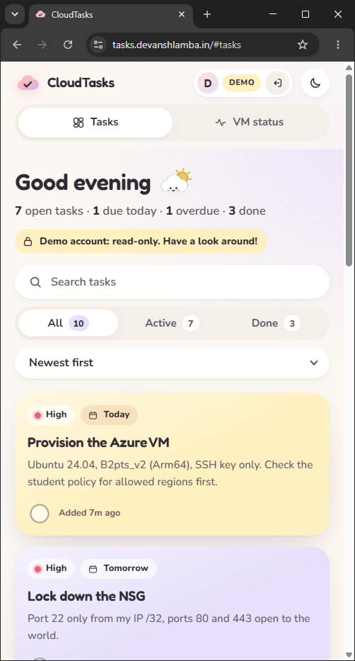
*Figure 23: Narrow (about 500 px) window: the user chip shrinks to avatar, badge and a sign-out icon.*

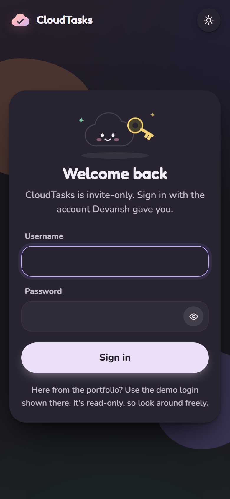
*Figure 24: Sign-in page on a phone-sized screen, dark theme.*

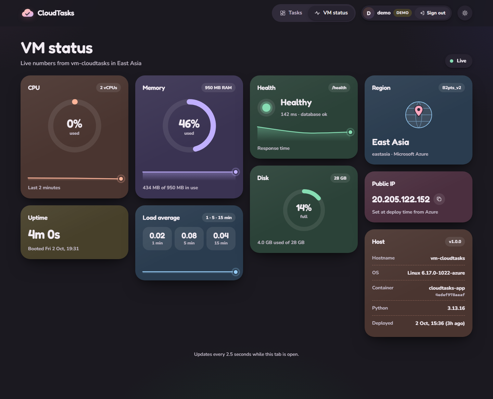
*Figure 25: VM status, dark theme.*

Other phase 2 captures in `docs/screenshots/`: `https-login-{desktop,mobile}-{light,dark}.png`, `https-demo-tasks-*`, `https-demo-status-*`, `https-demo-readonly-mobile.png`.

### 10.5 Paused state

> **PENDING:** real output of `./scripts/pause.ps1`, with its cost line.

> **PENDING:** screenshot (j): VM Overview showing status *Stopped (deallocated)*.
*Figure 18: (j) VM Overview after `pause.ps1`.*
