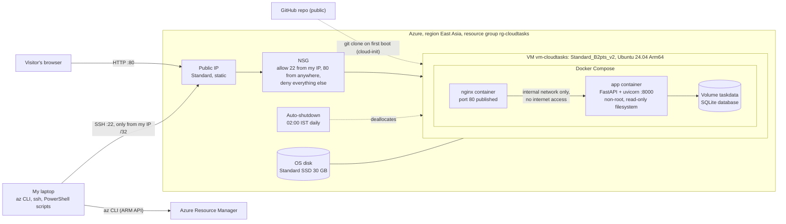

# PBL Report: Deployment to a Publicly Hosted Linux VM on Azure

**Project #16, Cloud Computing.** Application: *CloudTasks*, a task tracker with a live VM status panel.
Live URL during evaluation: `http://20.205.122.152/` · Code: `https://github.com/devanshlamba/azure-vm-deploy`

---

## 1. Objective

Build a real, small web application and deploy it to a Linux virtual machine on Microsoft Azure that anyone on the internet can reach, while:

- using **Infrastructure as a Service (IaaS)** directly: I create and manage the VM, network and firewall myself rather than using a managed platform;
- automating the whole deployment with the **Azure CLI** in repeatable scripts (deploy, pause, start, destroy);
- packaging the application in **containers** behind an **nginx reverse proxy**, with data on a **persistent volume**;
- applying sensible **security** (key-only SSH, a minimal firewall, no secrets, a hardened container); and
- keeping it **free**: Azure for Students credit only, no credit card, with a clear **cost model** for running, paused and deleted states.

## 2. Cloud concepts used

| Concept | What it means | Where it appears in this project |
|---|---|---|
| **IaaS** | The cloud provider runs the physical hardware; I manage the OS and everything above it. | I chose the OS image (Ubuntu 24.04), installed Docker, and run and patch the stack myself. |
| **Virtual machine** | A software-defined computer with a chosen number of vCPUs, amount of RAM and disk, billed per hour while it runs. | `vm-cloudtasks`, size `Standard_B2pts_v2` (2 vCPU Arm64, 1 GiB RAM), a burstable B-series size suited to mostly idle web apps. |
| **Region and policy** | Data-centre location; organisations can restrict which regions may be used. | Azure for Students allows only five regions. The script reads that policy and picks **East Asia** (Section 4). |
| **Public IP** | An internet-routable address attached to the VM's network interface. | `pip-cloudtasks`, Standard SKU, **static**, so the URL survives stop/start. |
| **NSG (network security group)** | A stateful firewall of allow/deny rules attached to a NIC or subnet. | Allows **22 only from my IP /32** and **80 from anywhere**; Azure's default rules deny all other inbound traffic. |
| **SSH keys** | Public-key authentication: the VM holds the public key, my laptop keeps the private key. | A new ed25519 key per project; password login disabled (verified: `disablePasswordAuthentication = true`). |
| **cloud-init** | A first-boot script that configures a fresh VM. | Installs Docker, adds swap, clones the repo, writes metadata and starts the containers, with no manual SSH steps. |
| **Containers** | An app packaged with its dependencies into an image that runs isolated on a shared kernel. | The app image (`python:3.13-slim`, non-root) and `nginx:1.30-alpine`, both run by **Docker Compose**. |
| **Reverse proxy** | A server in front of the app that receives client traffic and forwards it. | nginx is the only published service (port 80); it forwards to the app over an internal network and sets the client-IP headers. |
| **Persistent volume** | Storage that outlives the container. | Named volume `taskdata` holds the SQLite database; tasks survive rebuilds, restarts and VM stop/start. |
| **Managed disk** | The VM's virtual disk, billed per month by size and tier. | Standard SSD, 30 GB (billed as E4). |
| **Cost model** | Pay-as-you-go per resource; deallocating stops compute charges but not storage or IP charges. | Running / paused / destroyed costs in Section 7, with live prices pulled from the Azure Retail Prices API. |
| **Auto-shutdown** | A schedule that deallocates the VM at a fixed time. | 02:00 IST every day, a safety net against forgotten VMs. |

## 3. Architecture

**Azure resources** (all in `rg-cloudtasks`, so one command deletes everything): virtual machine, OS disk, NIC, public IP, NSG, VNet `10.20.0.0/24` with subnet `10.20.0.0/26`, and the auto-shutdown schedule (`Microsoft.DevTestLab/schedules`). Seven resources in total, as listed by `az resource list`.

**Application:**
- **Backend:** FastAPI on uvicorn with SQLite. The task API supports create, list, edit, toggle and delete. The status API reports CPU, RAM, disk, load and uptime via psutil.
- **Frontend:** one HTML page in plain JavaScript and CSS, with self-hosted fonts and inline SVG gauges and sparklines. It loads nothing from external sites.

**Request flow:** browser → public IP → NSG (port 80 allowed) → nginx container → app container over a Docker network marked `internal` → SQLite on the `taskdata` volume.

## 4. Implementation steps

1. **Application and tests.** Built the API with strict validation, the UI, and 18 automated API tests (pytest). Took screenshots with Playwright and refined the design based on them.
2. **Containers locally.**
   - **Dockerfile:** `python:3.13-slim` base, non-root user, healthcheck, plus a separate `test` stage so `docker build --target test .` runs the tests inside the image.
   - **Compose:** nginx on port 80; the app on an internal network; read-only filesystems, memory/CPU/process limits, restart always.
   - **Local checks:** verified the security properties (see Section 6).
3. **Choosing a region and size.** The script reads the student policy instead of guessing:

   | Allowed region | Auto-shutdown supported | Cheap B-series sizes available to my subscription |
   |---|---|---|
   | **East Asia** | yes | **yes**: B2pts_v2, B2ats_v2, B2als_v2 |
   | UAE North | yes | no, all `NotAvailableForSubscription` |
   | India South Central | no | yes |
   | Malaysia West, Indonesia Central | no | no |

   East Asia is the only region that satisfies both requirements. **Standard_B2pts_v2** is the cheapest size available there at 0.0116 USD/hour; the x86 B2ats_v2 costs 0.0131 USD/hour. Before choosing ARM, I confirmed that every component has an arm64 build: the Ubuntu image, both container base images and psutil.
4. **Deployment** (`scripts/deploy.ps1`).
   - Pre-flight checks, then the plan and cost per day; the script waits for an explicit `yes`.
   - Creates the resources with the Azure CLI. cloud-init then installs Docker from Docker's apt repository, clones the repo and runs `docker compose up -d --build`.
   - Total time from `yes` to a verified site: about **5 minutes**.
5. **Verification from my laptop.**
   - `http://20.205.122.152/` returned 200 with the page, and `/health` returned `{"status":"ok","database":"ok"}`.
   - The VM status tab showed the real region, size, VM name and IP. Port 8000 was unreachable from outside.
6. **Operations.**
   - `pause.ps1` (deallocate), `start.ps1` (start, re-pin the SSH rule to my current IP, verify).
   - `update.ps1` (git pull on the VM and rebuild; used once to ship a fix).
   - `destroy.ps1` (delete the resource group after typing its name).

## 5. Security choices

| Area | Choice | Why |
|---|---|---|
| Firewall | NSG: SSH only from my IP /32, HTTP from anywhere, default deny. `start.ps1` updates the SSH rule if my IP changes. | Shrinks the attack surface; bots constantly scan port 22 on public IPs. |
| Login | SSH key only (ed25519); password authentication disabled. | Rules out password brute-force. The private key never leaves my laptop and is excluded by `.gitignore`. |
| Network isolation | App container on an `internal: true` Docker network: no published port, no internet access. | Only nginx is reachable. Without internet access, the app couldn't send data out even if it were compromised. |
| Container hardening | Non-root user (uid 10001), read-only filesystem (only the database volume writable), all Linux capabilities dropped, `no-new-privileges`, memory/CPU/process limits; nginx is also read-only with minimal capabilities; the Docker socket is never mounted. | Limits what an attacker could do inside a container. |
| Input validation | Pydantic models: title 1–120 characters, note ≤ 500, priority and colour from fixed lists, valid dates, unknown fields rejected, control characters stripped. | Bad input is rejected before it reaches the database. |
| SQL injection | Bound parameters only; the column names used in updates come from a fixed allowlist. | User input can never become SQL. |
| XSS | All user text is rendered with `textContent`, never `innerHTML`. A Content-Security-Policy allows scripts only from the site itself, with no inline scripts. Plus `X-Frame-Options: DENY`, `nosniff`, `no-referrer`. | Even a task titled `` is shown as plain text (there is a test for this). |
| Rate limiting | 300 requests/min per visitor IP on `/api`. The `X-Real-IP` / `X-Forwarded-For` headers are trusted only from nginx's fixed address (`172.28.0.10/32`); nginx overwrites them. | Spoofed headers can't bypass the limit. Tested: 125 requests through nginx, each with a different fake IP header, gave exactly 120 allowed and 5 blocked (measured while the limit was 120). |
| Secrets | Nothing secret in code, image, git history or logs. Subscription and tenant IDs are never printed: every `az` query selects only the needed fields, and `az rest` fills in the subscription ID itself. | The repository is public. |
| Honest metadata | Region, size, VM name and IP are passed in as non-secret environment variables by the deploy script; `/api/info` reports `metadata_source: "deploy"` and the UI says "Set at deploy time from Azure". | The app has no internet access, so it can't call Azure's instance metadata service (IMDS), and IMDS doesn't return Standard-SKU public IPs anyway. |

## 6. Testing and measurements

| Check | Result |
|---|---|
| Automated API tests | **18 passed**, locally and inside the Docker `test` stage. They cover validation, create/edit/toggle/delete, 404s, XSS and security headers, sample tasks, metrics/info, metadata source, rate limiting, and trusted-proxy handling. |
| Docker isolation (local) | App port 8000 not reachable from the host; app has no internet access (DNS fails); app runs as uid 10001; writing outside `/data` fails ("Read-only file system"); tasks survived `docker compose down` / `up`. |
| Images | App image 238 MB on the VM, of which about 190 MB is the Python slim base; nginx 93 MB. |
| Memory on the 1 GiB VM | App 43 MiB, nginx 11 MiB, about 540 MB still available. Building the image on the VM used at most 42 MB of swap, with no out-of-memory kills. |
| Polling load | One VM status tab sends 24 `/api/metrics` + 1 `/api/info` + 1 `/api/tasks` per minute = **26 of 300** (about 9%). `/health` (24/min) is not rate limited. |
| Compression | `app.js` is 41 KB uncompressed and 14.8 KB gzipped by nginx. |
| Response time | About 110–130 ms for `/health` from my laptop in India to East Asia. |
| Screenshots | Desktop and mobile, light and dark, both views, taken from the live site with Playwright (`docs/screenshots/live-*.png`), with no browser console errors. |

## 7. Cost

Pay-as-you-go prices for East Asia, read from the Azure Retail Prices API on 2 October 2026:

| Resource | Price | Per day |
|---|---|---|
| VM Standard_B2pts_v2 (Linux) | 0.0116 USD/hour | 0.278 USD |
| Public IP, Standard static | 0.005 USD/hour (also while the VM is stopped) | 0.120 USD |
| OS disk, Standard SSD E4 (30 GB) | 2.40 USD/month | 0.079 USD |
| NSG, VNet, NIC, auto-shutdown | free | 0 |

| State | How to get there | USD/day | USD/month |
|---|---|---|---|
| **Running** | `deploy.ps1` or `start.ps1` | **0.477** | 14.51 |
| **Paused (deallocated)** | `pause.ps1` or auto-shutdown at 02:00 IST | **0.199** | 6.05 |
| **Destroyed** | `destroy.ps1` | **0** | 0 |

**Real cost.** The VM was created on 2 October 2026 at 10:04 UTC. By the time this report was written (about 1.5 hours later), the expected charge was about **0.03 USD**: 1.5 h × (0.0116 + 0.005) USD/hour + 1.5 h of disk. Azure shows billed usage 8–24 hours late. The final figure comes from *Cost Management → Cost analysis*, filtered to `rg-cloudtasks`.

> Billed cost for the project period (from the portal): **_____ USD**, for the period **_____ to _____**.

All charges come out of the Azure for Students credit; no credit card is linked. With 100 USD of credit, this setup could run nonstop for roughly 200 days.

## 8. Limitations

- **HTTP only, no HTTPS.** There is no domain name, so no TLS certificate. Traffic, including task text, is unencrypted. Next step: a domain plus Let's Encrypt via certbot, or Azure Front Door.
- **Single VM, single app process.** No redundancy or load balancing. The rate limiter keeps its counters in one process's memory and loses them on restart. Restarts or VM maintenance cause downtime.
- **Everyone shares one board.** There are no user accounts, so anyone with the URL can edit or delete tasks. Abuse is limited by validation, a 300-task cap and the rate limit, not by authentication.
- **SQLite on the VM's OS disk.** Data is lost when the resource group is destroyed, and there are no backups. A managed database or disk snapshots would fix that.
- **Shared IP addresses.** Many people behind one NAT (for example a college network) share the 300-requests-per-minute budget. About 11 VM status tabs can poll at the same time from one IP.
- **The paused state still costs money**, because the Standard static IP is billed while the VM is stopped.
- **The SSH rule depends on my IP.** If my ISP changes my IP, SSH is blocked until `start.ps1` (or a manual rule update) re-pins it.
- **No Trusted Launch.** The VM uses the `Standard` security type: the Azure CLI default didn't enable Trusted Launch for this Arm64 VM.
- **The image is built on the VM.** That takes a few minutes on a small burstable VM. A container registry with a prebuilt arm64 image would make deployments faster and more reproducible.

## 9. What I learned

- **Student policies shape the architecture.** The region I would have picked first (close to India) wasn't allowed. Of the allowed ones, only East Asia had both auto-shutdown support and VM sizes my subscription could use. Checking `az vm list-skus` restrictions per subscription, not just the region list, saved a failed deployment.
- **"Stopped" is not "deallocated", and deallocated isn't free.** Only deallocation stops VM billing. Disks and Standard static IPs keep costing money, which is why my paused state still costs 0.199 USD/day.
- **ARM is a real option for small workloads.** It was the cheapest size available; the only extra work was checking that every image and Python package had an arm64 build.
- **Defence in depth works in layers.** The NSG decides who reaches the VM, nginx is the only door into Docker, the internal network keeps the app off the internet, and the container itself is non-root and read-only. Each layer still helps if another one fails.
- **Trusting proxy headers is a trap.** Accepting `X-Forwarded-For` from anyone would let attackers bypass the rate limit just by changing a header. Trusting it only from nginx's fixed IP, and testing that, closed the gap.
- **Hardening has side effects.** Cutting the app off from the internet also cut it off from Azure's metadata service. I solved that by passing non-secret values in from the deploy script and labelling their source honestly in the UI.
- **Windows tooling quirks matter for automation.** `az` on Windows runs through `cmd.exe`, which cut a URL at its `&`, and PowerShell 5.1 stripped quotes inside SSH commands. Running the scripts for real, not just writing them, exposed both bugs.
- **Automation makes the cloud cheap to experiment with.** One command deploys, one pauses, one destroys, and every step is verified from outside the VM.

## 10. Screenshots

**Taken automatically from the live site** (`docs/screenshots/`):

| File | Shows |
|---|---|
| `live-desktop-light-tasks.png`, `live-desktop-dark-tasks.png` | Task board (masonry grid, priorities, due dates, done state) |
| `live-desktop-light-status.png`, `live-desktop-dark-status.png` | VM status with the real region (East Asia), size, VM name and public IP |
| `live-mobile-light-tasks.png`, `live-mobile-dark-tasks.png` | Mobile layout |
| `live-mobile-light-status.png`, `live-mobile-dark-status.png` | Mobile VM status |
| `live-desktop-light-empty.png` | Empty state before the sample tasks were loaded |
| `live-desktop-light-composer.png`, `live-mobile-light-composer.png` | Add-task dialog and mobile bottom sheet |

**To take yourself.** Before sharing, blur the **Subscription ID**, the **Directory/Tenant ID**, your **email address**, and **your home IP** in the NSG rule. The VM's public IP can stay visible.

From the **Azure portal**:

1. **Resource group `rg-cloudtasks` → Overview**: all 7 resources and the region East Asia.
2. **Virtual machine `vm-cloudtasks` → Overview**: status *Running*, size *Standard B2pts v2*, OS *Ubuntu 24.04*, location, public IP. The Essentials panel shows the Subscription ID, so blur it.
3. **VM → Networking → Network settings**: inbound port rules `AllowSshFromMyIp` (22, your IP /32, blur it) and `AllowHttp` (80, Internet), plus the default deny rules.
4. **VM → Operations → Auto-shutdown**: enabled, time 02:00 IST (the portal may display it as 20:30 UTC).
5. **VM → Settings → Disks**: OS disk, Standard SSD, 30 GiB.
6. **Public IP `pip-cloudtasks` → Overview**: SKU Standard, assignment Static, the IP address.
7. **VM → Monitoring → Metrics**: *Percentage CPU* over the last hour, ideally while the VM status tab is open.
8. **Subscription → Policies → Compliance (or Assignments)**: the *Allowed resource deployment regions* assignment and its allowed list. Blur the Subscription ID.
9. **Cost Management → Cost analysis**, scope `rg-cloudtasks`, at least a day after deployment: the actual cost, for Section 7.
10. **VM → Overview after `pause.ps1`**: status *Stopped (deallocated)*, to show the paused state.

From the **live site and your terminal**:

11. Browser at `http://20.205.122.152/` with the **address bar visible**, tasks view.
12. Browser on the **VM status** tab with the address bar visible, showing East Asia and 20.205.122.152.
13. Browser at `http://20.205.122.152/health`, showing the JSON `{"status":"ok","database":"ok",...}`.
14. Your **phone** on the live site, showing that it really is public.
15. Terminal: output of `./scripts/deploy.ps1 -PlanOnly` (plan and cost table). It shows your IP in the NSG line, so blur it.
16. Terminal: `ssh -i ~/.ssh/cloudtasks_azure_ed25519 azureuser@20.205.122.152` then `sudo docker compose -f /opt/cloudtasks/docker-compose.yml ps` (both containers *healthy*) and `free -m`.
17. Terminal: `./scripts/pause.ps1` and `./scripts/start.ps1` outputs with their cost lines.
18. *(Optional, proves the firewall)* An SSH attempt from your phone's hotspot or another network timing out, while `http://20.205.122.152/` still loads from there.
